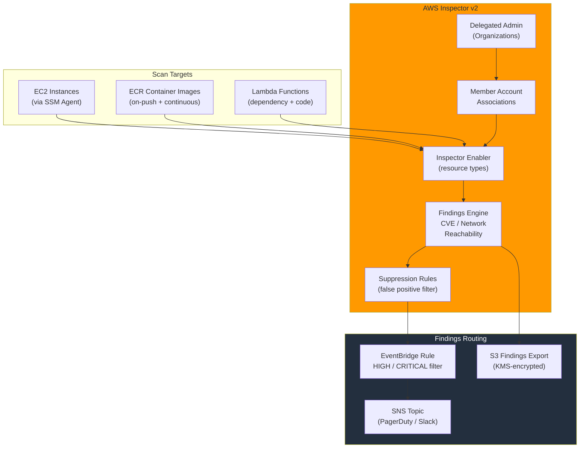

# tf-aws-inspector

Terraform module for **AWS Inspector v2** — continuous vulnerability management for EC2 instances, ECR container images, and Lambda functions.

## Features

| Capability | Description |
|---|---|
| **EC2 Scanning** | OS package CVEs + network reachability analysis via SSM Agent |
| **ECR Scanning** | Container image CVEs on push and continuously |
| **Lambda Scanning** | Function dependency CVEs (standard + code scanning) |
| **Org Delegation** | Designate a central security account as delegated admin |
| **Member Accounts** | Associate org member accounts for centralized findings |
| **Findings → SNS** | EventBridge rule to push HIGH/CRITICAL findings to SNS |
| **Findings → S3** | Native Inspector findings export to S3 |
| **Suppression Rules** | Filter false positives by CVE ID, resource type, or severity |

## Architecture



## Versioning

Review [CHANGELOG.md](CHANGELOG.md) before selecting a module version. Use explicit git tags such as `?ref=v1.0.0`, `?ref=v1.1.0`, or `?ref=v2.0.0` so deployments stay predictable.
## Usage

```hcl
module "inspector" {
  source      = "../../tf-aws-inspector"
  name        = "platform-security"
  environment = "prod"

  enable_ec2_scanning    = true
  enable_ecr_scanning    = true
  enable_lambda_scanning = true

  enable_findings_notifications = true
  findings_sns_topic_arn        = aws_sns_topic.security_alerts.arn
  findings_severity_filter      = ["HIGH", "CRITICAL"]
}
```

## Real-World Scenarios

See `examples/` for:

| Example | Scenario |
|---|---|
| `single-account` | Single-account setup: EC2 + ECR + Lambda scanning with SNS alerts |
| `multi-account-org` | Organization-wide: delegated admin + member accounts + S3 export |
| `devsecops-pipeline` | ECR scanning gating a CI/CD pipeline with suppression rules |

## Inputs

| Name | Type | Default | Description |
|---|---|---|---|
| `name` | `string` | — | Module name |
| `environment` | `string` | `"dev"` | Environment |
| `enable_ec2_scanning` | `bool` | `true` | Enable EC2 CVE scanning |
| `enable_ecr_scanning` | `bool` | `true` | Enable ECR image scanning |
| `enable_lambda_scanning` | `bool` | `false` | Enable Lambda scanning |
| `enable_lambda_code_scanning` | `bool` | `false` | Enable Lambda code scanning |
| `enable_delegated_admin` | `bool` | `false` | Enable Org delegated admin |
| `delegated_admin_account_id` | `string` | `null` | Security account ID |
| `member_accounts` | `list(object)` | `[]` | Member account IDs |
| `enable_findings_notifications` | `bool` | `false` | Enable SNS notifications |
| `findings_sns_topic_arn` | `string` | `null` | SNS topic ARN |
| `findings_severity_filter` | `list(string)` | `["HIGH","CRITICAL"]` | Severity filter |
| `enable_findings_export` | `bool` | `false` | Enable S3 export |
| `findings_export_bucket_name` | `string` | `null` | S3 bucket for export |
| `findings_export_kms_key_arn` | `string` | `null` | KMS key for S3 export |
| `suppression_rules` | `list(object)` | `[]` | Suppression filter rules |

## Outputs

| Name | Description |
|---|---|
| `enabled_resource_types` | Active scan resource types |
| `delegated_admin_account_id` | Delegated admin account |
| `member_account_ids` | Associated member accounts |
| `suppression_rule_arns` | Suppression rule ARNs |
| `findings_event_rule_arn` | EventBridge rule ARN |

