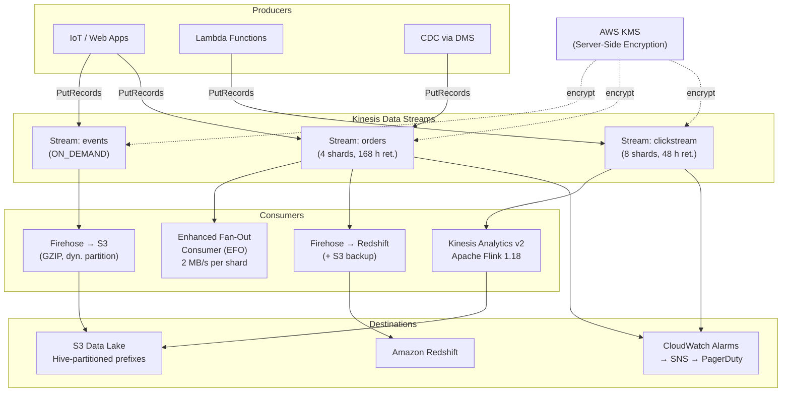

# tf-aws-kinesis — Examples

> Quick-start examples for the `tf-aws-kinesis` Terraform module.

## Available Examples

| Example | Description |
|---------|-------------|
| [minimal](minimal/) | Single ON_DEMAND Kinesis Data Stream with KMS encryption and no additional resources — ideal for getting started or low-traffic pipelines |
| [complete](complete/) | Full production setup: three streams (ON_DEMAND + PROVISIONED), Firehose to S3 and Redshift, Flink analytics application, Enhanced Fan-Out consumer, IAM roles, and CloudWatch alarms |

## Architecture



## Running an Example

```bash
cd minimal
terraform init
terraform apply

# For the complete example, supply variable values first:
cd complete
terraform init
terraform apply -var-file="prod.tfvars"
```
