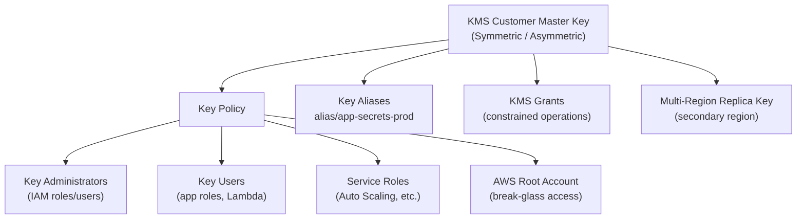

# tf-aws-kms

Terraform module for AWS KMS (Key Management Service).

## Features

- Symmetric and asymmetric CMK creation
- Automatic annual key rotation (symmetric keys)
- Multi-region keys
- Granular key policy: administrators + users + service roles
- Custom aliases (multiple per key)
- KMS Grants with optional constraints
- `prevent_destroy` lifecycle guard on the key
- Full tagging support with mandatory tags

## Security Controls

| Control | Implementation |
|---------|---------------|
| Key rotation | `enable_key_rotation = true` (default) |
| Root account access | Always included so account never loses key access |
| Least-privilege policy | Separate administrator / user / service-role statements |
| Deletion protection | `lifecycle { prevent_destroy = true }` |
| Deletion window | 30 days (configurable, min 7) |

## Architecture



## Versioning

Review [CHANGELOG.md](CHANGELOG.md) before selecting a module version. Use explicit git tags such as `?ref=v1.0.0`, `?ref=v1.1.0`, or `?ref=v2.0.0` so deployments stay predictable.
## Usage

```hcl
module "kms" {
  source = "git::https://github.com/your-org/tf-modules.git//tf-aws-kms?ref=v1.0.0"

  name        = "app-secrets"
  environment = "prod"
  project     = "my-project"
  owner       = "platform-team"
}
```

## Inputs

| Name | Description | Type | Default | Required |
|------|-------------|------|---------|----------|
| name | Base name for the key | `string` | — | yes |
| name_prefix | Prefix prepended to name | `string` | `""` | no |
| environment | Environment label | `string` | `"dev"` | no |
| project | Project name | `string` | `""` | no |
| owner | Owning team/person | `string` | `""` | no |
| cost_center | Billing cost center | `string` | `""` | no |
| tags | Extra tags | `map(string)` | `{}` | no |
| description | Key description | `string` | `"Managed by Terraform"` | no |
| key_usage | `ENCRYPT_DECRYPT` or `SIGN_VERIFY` | `string` | `"ENCRYPT_DECRYPT"` | no |
| customer_master_key_spec | Key spec | `string` | `"SYMMETRIC_DEFAULT"` | no |
| enable_key_rotation | Enable auto rotation | `bool` | `true` | no |
| deletion_window_in_days | Days before deletion (7-30) | `number` | `30` | no |
| is_enabled | Key enabled state | `bool` | `true` | no |
| multi_region | Multi-region key | `bool` | `false` | no |
| key_administrators | Admin IAM ARNs | `list(string)` | `[]` | no |
| key_users | User IAM ARNs | `list(string)` | `[]` | no |
| key_service_roles_for_autoscaling | Auto Scaling role ARNs | `list(string)` | `[]` | no |
| policy | Custom policy JSON (overrides built-in) | `string` | `""` | no |
| enable_default_policy | Include root account access | `bool` | `true` | no |
| aliases | Additional alias names | `list(string)` | `[]` | no |
| grants | KMS grants map | `map(object)` | `{}` | no |

## Outputs

| Name | Description |
|------|-------------|
| key_id | KMS key ID |
| key_arn | KMS key ARN |
| aliases | Map of alias name → ARN |
| primary_alias_name | Primary alias name |
| primary_alias_arn | Primary alias ARN |
| key_policy | Effective key policy JSON (sensitive) |

## Version Safety

- The key is guarded with `lifecycle { prevent_destroy = true }`.
- To **intentionally** destroy: remove or set `prevent_destroy = false`, run `terraform apply`, then `terraform destroy`.
- Aliases use `create_before_destroy = true` so renaming never causes downtime.
- Use `moved {}` blocks when refactoring the module reference to avoid re-creation.

## Examples

- [Basic](examples/basic/) — minimal key with defaults
- [Complete](examples/complete/) — all options including grants, multi-region, custom aliases

