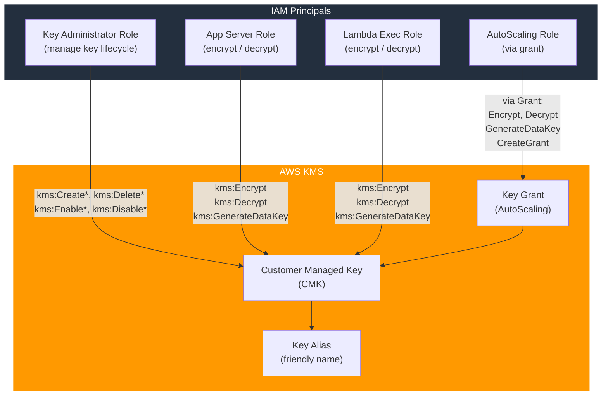

# tf-aws-kms Examples

Runnable examples for the [`tf-aws-kms`](../) Terraform module.

## Available Examples

| Example | Description |
|---------|-------------|
| [minimal](minimal/) | Minimal configuration — provider and version constraints only, no KMS resources created |
| [complete](complete/) | Full configuration with key rotation, multi-region support, key administrators, key users, grants, and aliases |

## Architecture



## Quick Start

```bash
cd complete/
terraform init
terraform apply -var-file="dev.tfvars"
```
