# tf-aws-lambda

Terraform module for AWS Lambda functions.

## Features

- Auto-creates execution IAM role with configurable policies
- VPC support (auto-attaches VPC execution policy)
- KMS encryption for environment variables
- X-Ray tracing enabled by default
- CloudWatch log group with configurable retention and KMS
- `publish = true` with alias support
- Event source mappings (SQS, DynamoDB, Kinesis)
- Lambda permissions/triggers map
- Dead letter queue (SQS/SNS)
- Lambda layers support

## Security Controls

| Control | Default |
|---------|---------|
| X-Ray tracing | `Active` |
| KMS env var encryption | Optional (`kms_key_arn`) |
| Log retention | 30 days |
| Reserved concurrency | `-1` (no throttle; set explicitly for prod) |
| VPC | Optional |

## Architecture

```mermaid
graph TB
    subgraph Function["Lambda Function"]
        FN["Function Code\n(zip · S3 · Container)"]
        ALIAS["Alias\n(live · canary)"]
        LAYER["Lambda Layers\n(shared dependencies)"]
        URL["Function URL\n(optional HTTPS)"]
    end

    subgraph Triggers["Event Sources / Triggers"]
        ESM["Event Source Mappings\n(SQS · DynamoDB · Kinesis)"]
        EB["EventBridge Scheduler\n(cron / rate)"]
        PERM["Lambda Permissions\n(API GW · SNS · S3)"]
    end

    subgraph Async["Async Destinations"]
        DLQ["Dead Letter Queue\n(SQS / SNS)"]
        ONDEST["On-Success / On-Failure\n(SQS · SNS · Lambda)"]
    end

    subgraph Observability["Observability"]
        CW["CloudWatch Log Group\n(KMS encrypted · retention)"]
        XRAY["X-Ray Tracing\n(Active)"]
        ALARM["CloudWatch Alarms\n(errors · throttles · duration)"]
    end

    subgraph IAM["IAM"]
        ROLE["Execution Role\n(auto-created)"]
    end

    subgraph Network["VPC (optional)"]
        ENI["VPC ENI\n(private subnets)"]
        SG["Security Group"]
    end

    KMS["KMS Key\n(env vars · logs)"]
    EFS["EFS Access Point\n(optional mount)"]
    AS["Application Auto Scaling\n(provisioned concurrency)"]

    ESM --> FN
    EB --> FN
    PERM --> FN
    FN --> ALIAS
    FN --> LAYER
    FN --> URL
    FN --> DLQ
    FN --> ONDEST
    FN --> CW
    FN --> XRAY
    ALARM --> CW
    ROLE --> FN
    KMS --> FN
    KMS --> CW
    FN --> ENI
    SG --> ENI
    FN --> EFS
    AS --> ALIAS

    style Function fill:#FF9900,color:#fff,stroke:#FF9900
    style Triggers fill:#232F3E,color:#fff,stroke:#232F3E
    style Async fill:#E7157B,color:#fff,stroke:#E7157B
    style Observability fill:#FF4F8B,color:#fff,stroke:#FF4F8B
    style IAM fill:#DD344C,color:#fff,stroke:#DD344C
    style Network fill:#1A73E8,color:#fff,stroke:#1A73E8
    style KMS fill:#8C4FFF,color:#fff,stroke:#8C4FFF
```



## Versioning

Review [CHANGELOG.md](CHANGELOG.md) before selecting a module version. Use explicit git tags such as `?ref=v1.0.0`, `?ref=v1.1.0`, or `?ref=v2.0.0` so deployments stay predictable.
## Usage

```hcl
module "lambda" {
  source        = "git::https://github.com/your-org/tf-modules.git//tf-aws-lambda?ref=v1.0.0"
  function_name = "data-processor"
  handler       = "app.handler"
  runtime       = "python3.12"
  filename      = "${path.module}/package.zip"
  source_code_hash = filebase64sha256("${path.module}/package.zip")
  kms_key_arn   = module.kms.key_arn
}
```

## Examples

- [Basic](examples/basic/)
- [Complete](examples/complete/)

