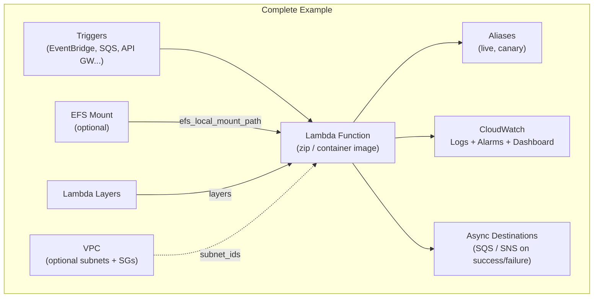

# tf-aws-lambda Examples

Runnable examples for the [`tf-aws-lambda`](../) Terraform module.

## Available Examples

| Example | Description |
|---------|-------------|
| [basic](basic/) | Minimal configuration — Python function from a local zip, auto-created IAM role, CloudWatch Logs, and optional CloudWatch alarms |
| [complete](complete/) | Full configuration with VPC or non-VPC deployment, container image or zip/S3 code source, aliases, provisioned concurrency with auto-scaling, SQS/DynamoDB/Kinesis event source mappings, EventBridge schedules, Function URL, EFS mount, Lambda Layers, X-Ray tracing, async destinations, CloudWatch dashboard, and Lambda Insights |

## Architecture



## Quick Start

```bash
cd basic/
terraform init
terraform apply -var-file="dev.tfvars"
```
