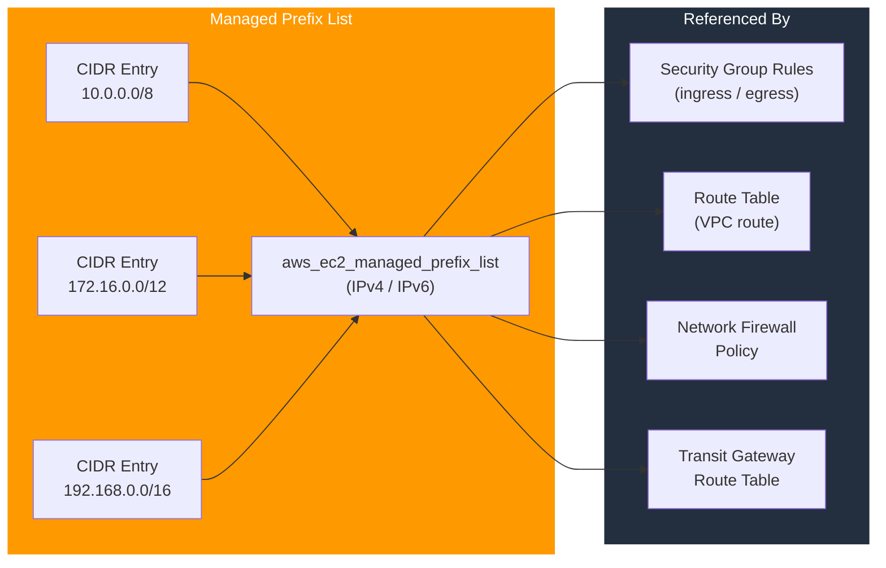

# tf-aws-managed-prefix

Terraform module for AWS EC2 Managed Prefix Lists — reusable named CIDR collections that can be referenced in security group rules, route tables, and AWS Network Firewall policies instead of maintaining duplicate IP lists.

---

## Architecture



---

## Features

- Managed prefix lists for IPv4 or IPv6 address families
- Bulk CIDR entry management with input validation
- Single prefix list referenced by multiple security groups — update the list once, all rules update automatically
- `allow_replacement` guard to prevent accidental destruction of in-use prefix lists
- Sorted entry output for deterministic plan output

## Why Managed Prefix Lists?

| Without Prefix List | With Prefix List |
|--------------------|-----------------|
| Duplicate CIDRs in every SG rule | Single source of truth |
| Manual update in N security groups | Update prefix list once |
| Hit 60-rule SG limit quickly | One rule per SG referencing the list |
| Hard to audit which IPs are allowed | Named, tagged list is self-documenting |

## Versioning

Use explicit git tags such as `?ref=v1.0.0` to pin your deployments.

## Usage

```hcl
module "corporate_cidrs" {
  source = "git::https://github.com/your-org/golden_modules.git//tf-aws-managed-prefix?ref=v1.0.0"

  name           = "corporate-networks"
  address_family = "IPv4"

  entries_list = [
    "10.0.0.0/8",
    "172.16.0.0/12",
    "192.168.0.0/16",
  ]

  tags = {
    Environment = "all"
    ManagedBy   = "terraform"
  }
}

# Reference in a security group rule
resource "aws_vpc_security_group_ingress_rule" "corp" {
  security_group_id = aws_security_group.app.id
  prefix_list_id    = module.corporate_cidrs.id
  ip_protocol       = "tcp"
  from_port         = 443
  to_port           = 443
}
```

## Outputs

| Output | Description |
|--------|------------|
| `id` | Prefix list ID (`pl-xxxxxxxxxxxxxxxxx`) |
| `entries` | Sorted list of CIDR entries |
| `arn` | Full ARN of the prefix list |

## Examples

- [Corporate network CIDRs](examples/corporate/)
- [VPN tunnel endpoints](examples/vpn-endpoints/)
