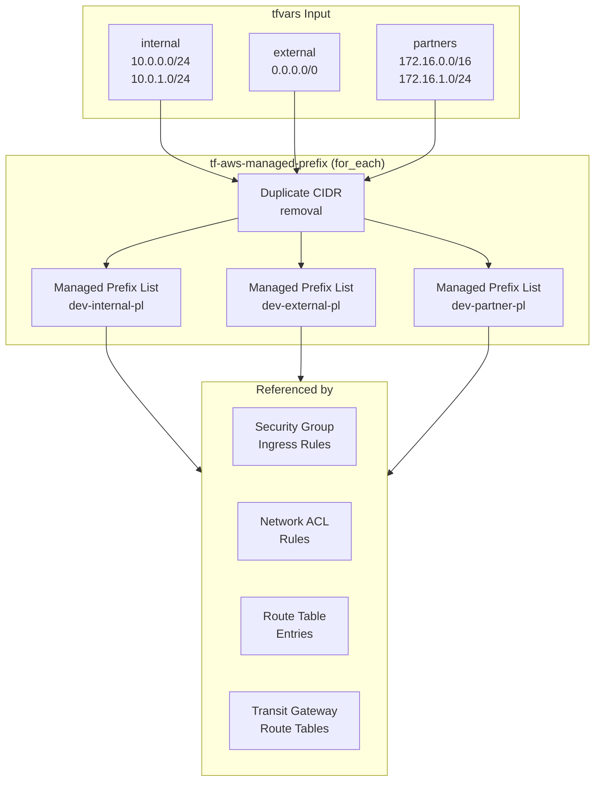

# tf-aws-managed-prefix Examples

Runnable examples for the [`tf-aws-managed-prefix`](../) Terraform module.

## Available Examples

| Example | Description |
|---------|-------------|
| [basic](.) | Minimal configuration — create multiple named managed prefix lists (internal, external, partners) from CIDR lists with automatic duplicate removal |

## Architecture



## Quick Start

```bash
cd basic/
terraform init
terraform apply -var-file="terraform.tfvars"
```
