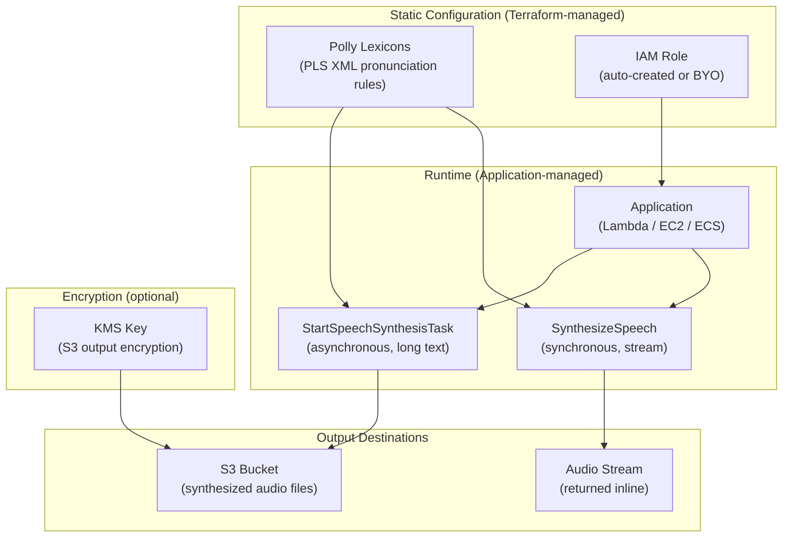

# tf-aws-polly

Terraform module for managing **Amazon Polly** lexicons and IAM access infrastructure.

Amazon Polly is a text-to-speech service. This module manages the supporting infrastructure:
custom pronunciation **lexicons** (PLS XML format) and the **IAM role** that grants callers
(Lambda, EC2, etc.) permission to invoke Polly APIs.

> **Note on SynthesizeSpeech**: The actual `SynthesizeSpeech` (and `StartSpeechSynthesisTask`)
> API calls are runtime operations made by your application code. There is no Terraform resource
> for synthesizing speech — Terraform only manages the _static configuration_ (lexicons, IAM).

---

## Features

| Feature | Variable | Default |
|---|---|---|
| Create pronunciation lexicons | `create_lexicons` | `false` |
| Auto-create IAM role | `create_iam_role` | `true` |
| BYO IAM role | `role_arn` | `null` |
| S3 audio output write access | `enable_s3_output` | `false` |

---

## Minimal example — create lexicons with custom pronunciations

```hcl
module "polly" {
  source = "./tf-aws-polly"

  name_prefix     = "myapp"
  create_lexicons = true

  lexicons = {
    w3c-terms = {
      content = <<-PLS
        <?xml version="1.0" encoding="UTF-8"?>
        <lexicon version="1.0"
          xmlns="http://www.w3.org/2005/01/pronunciation-lexicon"
          alphabet="ipa"
          xml:lang="en-US">
          <lexeme>
            <grapheme>W3C</grapheme>
            <alias>World Wide Web Consortium</alias>
          </lexeme>
          <lexeme>
            <grapheme>AWS</grapheme>
            <alias>Amazon Web Services</alias>
          </lexeme>
        </lexicon>
      PLS
    }
  }

  tags = {
    Environment = "production"
    Team        = "platform"
  }
}

output "lexicon_names" {
  value = module.polly.lexicon_names
}

output "iam_role_arn" {
  value = module.polly.iam_role_arn
}
```

---

## BYO IAM role example

Use an existing IAM role from your `tf-aws-iam` module instead of auto-creating one:

```hcl
module "polly" {
  source = "./tf-aws-polly"

  name_prefix     = "myapp"
  create_iam_role = false
  role_arn        = "arn:aws:iam::123456789012:role/my-existing-polly-role"

  create_lexicons = true
  lexicons = {
    brand-names = {
      content = file("${path.module}/lexicons/brand-names.pls")
    }
  }
}
```

---

## IAM role with S3 audio output

Enable write access so Polly can store synthesized audio in S3 (used with
`StartSpeechSynthesisTask`):

```hcl
module "polly" {
  source = "./tf-aws-polly"

  name_prefix          = "myapp"
  create_iam_role      = true
  enable_s3_output     = true
  s3_output_bucket_arn = "arn:aws:s3:::my-audio-bucket"

  tags = { Environment = "production" }
}
```

---

## Supported voices and languages

Amazon Polly supports 60+ voices across 30+ languages. Common selections:

| Language | Voice IDs (Standard) | Voice IDs (Neural) |
|---|---|---|
| English (US) | Joanna, Matthew, Ivy, Kendra | Joanna, Matthew, Kevin |
| English (GB) | Amy, Brian, Emma | Amy, Brian, Emma |
| Spanish (US) | Lupe, Miguel, Penelope | Lupe |
| Spanish (ES) | Conchita, Enrique | Lucia |
| French (FR) | Celine, Mathieu | Lea |
| German (DE) | Hans, Marlene, Vicki | Daniel |
| Japanese | Mizuki, Takumi | Kazuha, Tomoko |
| Portuguese (BR) | Camila, Ricardo, Vitoria | Camila, Thiago |

Voices are specified at **runtime** (in `SynthesizeSpeech` API calls), not via Terraform.
Use `polly:DescribeVoices` to list all available voices programmatically.

---

## Lexicon format (PLS XML)

Lexicons must be valid **W3C Pronunciation Lexicon Specification (PLS)** XML documents:

```xml
<?xml version="1.0" encoding="UTF-8"?>
<lexicon version="1.0"
  xmlns="http://www.w3.org/2005/01/pronunciation-lexicon"
  alphabet="ipa"
  xml:lang="en-US">
  <lexeme>
    <grapheme>AWS</grapheme>
    <alias>Amazon Web Services</alias>
  </lexeme>
  <lexeme>
    <grapheme>Terraform</grapheme>
    <phoneme>ˈtɛrəfɔːrm</phoneme>
  </lexeme>
</lexicon>
```

Constraints:
- Maximum **100 lexicons** per AWS region per account
- Maximum **4,000 characters** per lexicon
- Maximum **100 lexemes** per lexicon
- Lexicon name: 1–20 alphanumeric characters

---

## Architecture



## Requirements

| Name | Version |
|---|---|
| terraform | >= 1.3.0 |
| aws | >= 5.0 |

## Providers

| Name | Version |
|---|---|
| aws | >= 5.0 |

## Resources

| Name | Type |
|---|---|
| aws_polly_lexicon.this | resource |
| aws_iam_role.polly | resource |
| aws_iam_role_policy.polly_inline | resource |
| data.aws_region.current | data source |
| data.aws_caller_identity.current | data source |
| data.aws_partition.current | data source |
| data.aws_iam_policy_document.polly_assume_role | data source |
| data.aws_iam_policy_document.polly_inline | data source |

## Inputs

| Name | Description | Type | Default |
|---|---|---|---|
| `create_lexicons` | Set true to create Polly pronunciation lexicons. | `bool` | `false` |
| `create_iam_role` | Auto-create IAM role for Polly access. | `bool` | `true` |
| `role_arn` | Existing IAM role ARN. Used when `create_iam_role = false`. | `string` | `null` |
| `name_prefix` | Prefix for all resource names. | `string` | `""` |
| `tags` | Tags applied to all resources. | `map(string)` | `{}` |
| `lexicons` | Map of Polly lexicons. Key = lexicon name. | `map(object({content=string}))` | `{}` |
| `enable_s3_output` | Grant IAM role S3 write access for audio output. | `bool` | `false` |
| `s3_output_bucket_arn` | ARN of S3 bucket for Polly audio output. | `string` | `null` |

## Outputs

| Name | Description |
|---|---|
| `lexicon_names` | Map of lexicon names (key → name). |
| `lexicon_arns` | Map of lexicon ARNs (key → ARN). |
| `iam_role_arn` | IAM role ARN used for Polly access. |
| `iam_role_name` | IAM role name (null when BYO). |

## Versioning

Review [CHANGELOG.md](CHANGELOG.md) before selecting a module version. Use explicit git tags such as `?ref=v1.0.0`, `?ref=v1.1.0`, or `?ref=v2.0.0` so deployments stay predictable.

