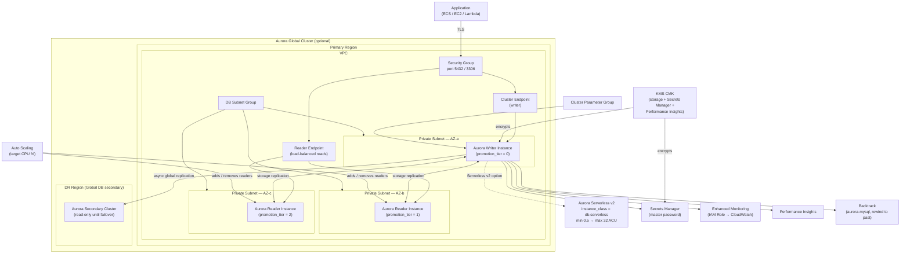

# tf-aws-rds-aurora

Terraform module for AWS Aurora clusters (MySQL and PostgreSQL).

## Features

- Aurora MySQL and Aurora PostgreSQL
- Provisioned instances (any instance class)
- **Aurora Serverless v2** (`db.serverless` + `serverlessv2_scaling_configuration`)
- Aurora Global Database (multi-region)
- Multiple cluster instances via `for_each` (writer + N readers)
- Auto Scaling of read replicas (CPU-based)
- Managed master password via Secrets Manager
- Cluster parameter groups
- Enhanced Monitoring + Performance Insights
- Backtrack (aurora-mysql)
- `prevent_destroy` on cluster and instances
- `ignore_changes = [master_password, global_cluster_identifier]`

## Engine Combinations

| Use Case | engine | engine_version | instance_class |
|----------|--------|---------------|----------------|
| Aurora PostgreSQL 15 | `aurora-postgresql` | `15.4` | `db.t3.medium` |
| Aurora MySQL 8.0 | `aurora-mysql` | `8.0.mysql_aurora.3.04.0` | `db.t3.medium` |
| Aurora Serverless v2 (PG) | `aurora-postgresql` | `15.4` | `db.serverless` |
| Aurora Serverless v2 (MySQL) | `aurora-mysql` | `8.0.mysql_aurora.3.04.0` | `db.serverless` |

## Architecture



---

## Versioning

Review [CHANGELOG.md](CHANGELOG.md) before selecting a module version. Use explicit git tags such as `?ref=v1.0.0`, `?ref=v1.1.0`, or `?ref=v2.0.0` so deployments stay predictable.
## Usage

```hcl
# Provisioned Aurora PostgreSQL with 1 writer + 2 readers
module "aurora" {
  source = "git::https://github.com/your-org/tf-modules.git//tf-aws-rds-aurora?ref=v1.0.0"

  name                 = "platform-db"
  engine               = "aurora-postgresql"
  engine_version       = "15.4"
  db_subnet_group_name = module.vpc.database_subnet_group_name
  vpc_security_group_ids = [module.db_sg.security_group_id]
  kms_key_id           = module.kms.key_arn

  cluster_instances = {
    "1" = { promotion_tier = 0 }  # writer
    "2" = { promotion_tier = 1 }  # reader
    "3" = { promotion_tier = 2 }  # reader
  }

  autoscaling_enabled  = true
  autoscaling_max_capacity = 5
}
```

```hcl
# Aurora Serverless v2
module "aurora_serverless" {
  source = "..."
  name   = "serverless-db"
  engine = "aurora-postgresql"
  engine_version = "15.4"

  serverlessv2_scaling = [{ min_capacity = 0.5; max_capacity = 16 }]
  cluster_instances = { "1" = { instance_class = "db.serverless" } }
  db_subnet_group_name = module.vpc.database_subnet_group_name
}
```

## Examples

- [Basic](examples/basic/)
- [Complete with Global Cluster + Serverless v2](examples/complete/)

