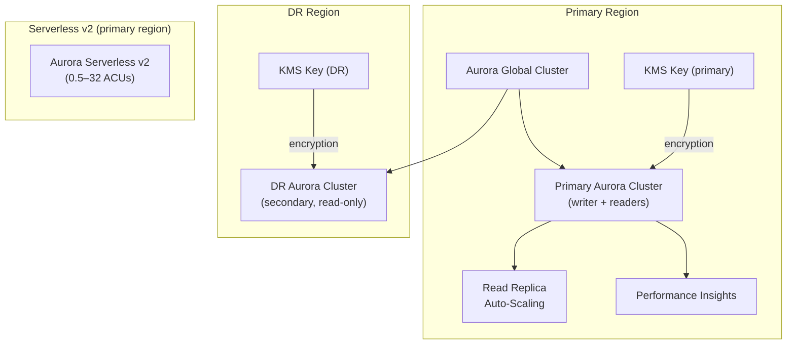

# tf-aws-rds-aurora Examples

Runnable examples for the [`tf-aws-rds-aurora`](../) Terraform module.

## Available Examples

| Example | Description |
|---------|-------------|
| [basic](basic/) | Minimal configuration — Aurora cluster with engine, instance class, subnet group, KMS encryption, and configurable instance count |
| [complete](complete/) | Full configuration with a Global Database spanning primary and DR regions, Aurora Serverless v2 cluster, read-replica auto-scaling, Performance Insights, cluster parameter group, and region-specific KMS keys |

## Architecture



## Quick Start

```bash
cd basic/
terraform init
terraform apply -var-file="dev.tfvars"
```
