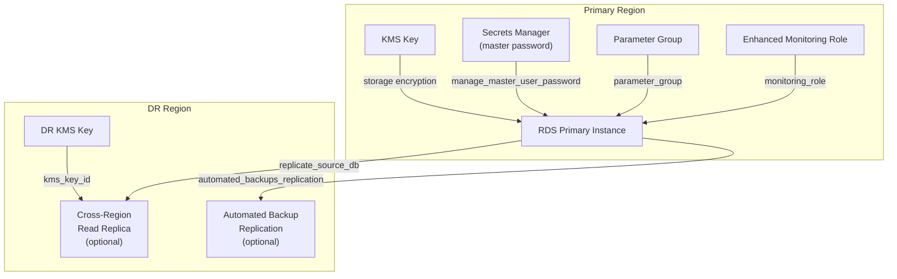

# tf-aws-rds Examples

Runnable examples for the [`tf-aws-rds`](../) Terraform module.

## Available Examples

| Example | Description |
|---------|-------------|
| [basic](basic/) | Minimal configuration — single RDS instance with engine, instance class, subnet group, Multi-AZ toggle, and deletion protection |
| [complete](complete/) | Full single-region configuration with KMS encryption, Secrets Manager password, storage autoscaling, enhanced monitoring, Performance Insights, parameter group, and CloudWatch log exports |
| [complete-all-engines](complete-all-engines/) | Demonstrates all supported engines in one configuration: PostgreSQL primary + read replica, MySQL with audit option group, Oracle EE with NNE/STATSPACK options, SQL Server EE with TDE/native backup, and MariaDB |
| [cross_region](cross_region/) | Generic cross-region template (engine-agnostic) — choose between automated backup replication to DR region, live cross-region read replica, or both |
| [cross_region_aurora_mysql](cross_region_aurora_mysql/) | Aurora MySQL Global Database with a primary cluster in one region and an optional secondary cluster in a DR region via `aws_rds_global_cluster` |
| [cross_region_aurora_postgres](cross_region_aurora_postgres/) | Aurora PostgreSQL Global Database with primary and optional DR secondary cluster, using region-specific KMS keys and security groups |
| [cross_region_mariadb](cross_region_mariadb/) | MariaDB primary with optional automated backup replication and/or live cross-region read replica in DR region |
| [cross_region_mysql](cross_region_mysql/) | MySQL primary with choice-based toggles for automated backup replication to DR and/or live cross-region read replica |
| [cross_region_oracle](cross_region_oracle/) | Oracle (EE/SE2/CDB editions) primary with BYOL or license-included, NCHAR charset support, option group, backup replication, and optional cross-region replica |
| [cross_region_postgres](cross_region_postgres/) | PostgreSQL primary with choice-based automated backup replication and/or cross-region read replica using separate provider aliases |
| [cross_region_sqlserver](cross_region_sqlserver/) | SQL Server (EE/SE/EX/Web) with automated backup replication to DR — note: SQL Server does not support cross-region read replicas; AD/Windows Auth configuration also shown |

## Architecture



## Quick Start

```bash
cd basic/
terraform init
terraform apply -var-file="dev.tfvars"
```
