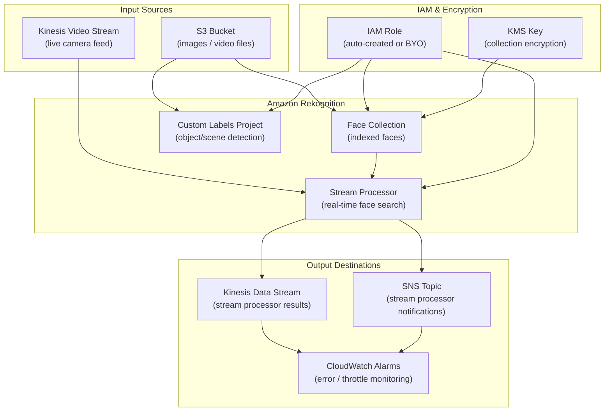

# tf-aws-rekognition

Production-grade Terraform module for AWS Rekognition. Manages face collections,
video stream processors, Custom Labels projects, IAM roles, and CloudWatch alarms
through a clean, opt-in feature-gate interface.

---

## Features

| Feature | Gate variable | Default |
|---|---|---|
| Face collections | `create_collections` | `false` |
| Stream processors | `create_stream_processors` | `false` |
| Custom Labels projects | `create_custom_labels_projects` | `false` |
| CloudWatch alarms | `create_alarms` | `false` |
| Auto-create IAM role | `create_iam_role` | `true` |

---

## Requirements

| Name | Version |
|---|---|
| Terraform | >= 1.3.0 |
| hashicorp/aws | >= 5.0 |

---

## Versioning

Review [CHANGELOG.md](CHANGELOG.md) before selecting a module version. Use explicit git tags such as `?ref=v1.0.0`, `?ref=v1.1.0`, or `?ref=v2.0.0` so deployments stay predictable.
## Usage

### Minimal — create one face collection

```hcl
module "rekognition" {
  source = "git::https://github.com/your-org/tf-aws-rekognition.git"

  create_collections = true

  collections = {
    "prod-faces" = { tags = {} }
  }

  name_prefix = "prod"
  tags = {
    Environment = "production"
    Team        = "platform"
  }
}

output "collection_arn" {
  value = module.rekognition.collection_arns["prod-faces"]
}
```

---

### Advanced — stream processor with Kinesis and alarms

```hcl
module "rekognition" {
  source = "git::https://github.com/your-org/tf-aws-rekognition.git"

  # Create the face collection that the stream processor will reference.
  create_collections = true
  collections = {
    "entrance-faces" = { tags = { Zone = "lobby" } }
  }

  # Create a stream processor that detects faces from a KVS feed.
  create_stream_processors = true
  stream_processors = {
    "entrance-cam" = {
      kinesis_video_stream_arn = "arn:aws:kinesisvideo:us-east-1:123456789012:stream/entrance-cam/0"
      kinesis_data_stream_arn  = "arn:aws:kinesis:us-east-1:123456789012:stream/rekognition-results"

      face_search = {
        collection_id        = "prod-entrance-faces"   # note: name_prefix is applied
        face_match_threshold = 90
      }

      notification_sns_arn = "arn:aws:sns:us-east-1:123456789012:rekognition-alerts"

      data_sharing_preference_opt_in = false

      # Optional: restrict analysis to a sub-region of the frame.
      regions_of_interest = [
        { left = 0.1, top = 0.1, width = 0.8, height = 0.8 }
      ]

      tags = { Camera = "entrance" }
    }
  }

  # Fire alarms when errors or throttles occur.
  create_alarms    = true
  alarm_sns_arns   = ["arn:aws:sns:us-east-1:123456789012:ops-pagerduty"]
  alarm_threshold  = 1

  # Encrypt with a customer-managed KMS key (from tf-aws-kms).
  kms_key_arn = "arn:aws:kms:us-east-1:123456789012:key/mrk-abc123"

  name_prefix = "prod"
  tags = {
    Environment = "production"
  }
}
```

---

### BYO IAM role (from tf-aws-iam)

Pass an existing IAM role ARN and disable auto-creation:

```hcl
module "iam" {
  source = "git::https://github.com/your-org/tf-aws-iam.git"
  # ... create a role with Rekognition trust policy ...
}

module "rekognition" {
  source = "git::https://github.com/your-org/tf-aws-rekognition.git"

  # Disable auto-created role and supply the existing one.
  create_iam_role = false
  role_arn        = module.iam.role_arn

  create_collections = true
  collections = {
    "shared-faces" = { tags = {} }
  }

  name_prefix = "prod"
  tags        = { Environment = "production" }
}
```

---

### Custom Labels project

```hcl
module "rekognition" {
  source = "git::https://github.com/your-org/tf-aws-rekognition.git"

  create_custom_labels_projects = true
  custom_labels_projects = {
    "defect-detector" = { tags = { CostCenter = "ml-platform" } }
    "product-tagger"  = { tags = { CostCenter = "ecommerce" } }
  }

  name_prefix = "prod"
  tags        = { Environment = "production" }
}

output "project_arns" {
  value = module.rekognition.custom_labels_project_arns
}
```

---

## Inputs

### Feature gates

| Name | Description | Type | Default |
|---|---|---|---|
| `create_collections` | Create Rekognition face collections | `bool` | `false` |
| `create_stream_processors` | Create Rekognition stream processors | `bool` | `false` |
| `create_custom_labels_projects` | Create Custom Labels projects | `bool` | `false` |
| `create_alarms` | Create CloudWatch alarms | `bool` | `false` |
| `create_iam_role` | Auto-create IAM role | `bool` | `true` |

### Resources

| Name | Description | Type | Default |
|---|---|---|---|
| `collections` | Map of face collections | `map(object)` | `{}` |
| `stream_processors` | Map of stream processors | `map(object)` | `{}` |
| `custom_labels_projects` | Map of Custom Labels projects | `map(object)` | `{}` |
| `role_arn` | Existing IAM role ARN (BYO) | `string` | `null` |
| `kms_key_arn` | KMS key ARN for encryption | `string` | `null` |
| `alarm_sns_arns` | SNS ARNs for alarm notifications | `list(string)` | `[]` |
| `alarm_error_threshold` | Error count before alarm fires | `number` | `1` |
| `alarm_evaluation_periods` | Consecutive breach periods | `number` | `1` |
| `alarm_period_seconds` | Evaluation period in seconds | `number` | `300` |
| `name_prefix` | Resource name prefix | `string` | `""` |
| `tags` | Tags applied to all resources | `map(string)` | `{}` |

---

## Outputs

| Name | Description |
|---|---|
| `collection_ids` | Map of collection key → collection_id |
| `collection_arns` | Map of collection key → ARN |
| `stream_processor_arns` | Map of stream processor key → ARN |
| `stream_processor_names` | Map of stream processor key → name |
| `custom_labels_project_arns` | Map of project key → ARN |
| `custom_labels_project_names` | Map of project key → name |
| `iam_role_arn` | ARN of the IAM role in use |
| `iam_role_name` | Name of the auto-created IAM role (`null` for BYO) |
| `alarm_arns` | Map of alarm key → ARN |
| `aws_account_id` | Deploying AWS account ID |
| `aws_region` | Deploying AWS region |

---

## Architecture



## IAM permissions auto-created

When `create_iam_role = true` the module creates a least-privilege inline policy covering:

- Core Rekognition API calls (collections, stream processors, custom labels)
- S3 `GetObject` / `ListBucket` for source images and videos
- Kinesis Video Streams read (stream processor input)
- Kinesis Data Streams write (stream processor output)
- CloudWatch Logs write under `/aws/rekognition/*`
- SNS `Publish` for notification channels
- KMS `Decrypt` / `GenerateDataKey` when `kms_key_arn` is set

---

## Testing

See [tests/README.md](tests/README.md).

---

## License

Apache 2.0

