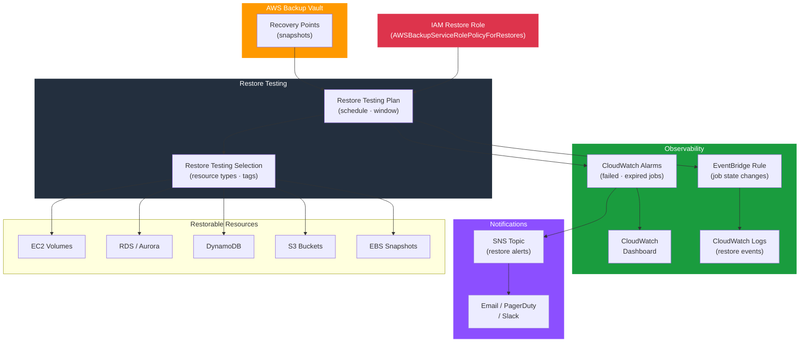

# tf-aws-restore

Terraform module for AWS Backup restore operations — restore testing plans, IAM roles, SNS notifications, CloudWatch alarms for failed jobs, and a monitoring dashboard.

---

## Architecture



---

## Features

- IAM role for AWS Backup restore operations (auto-created or BYO)
- Restore testing plans with configurable schedule and completion windows
- Restore testing selections scoped by resource type and/or resource tags
- Supported restore types: EC2, EBS, RDS, DynamoDB, S3
- SNS topic (auto-created or BYO) for restore job alerts
- CloudWatch alarms for failed and expired restore jobs
- EventBridge → CloudWatch Logs pipeline for all restore state changes
- CloudWatch dashboard with restore job metrics

## Security Controls

| Control | Implementation |
|---------|---------------|
| Scoped restore permissions | Dedicated IAM role — no wildcard resource access |
| Encrypted restore targets | Inherits KMS key from source recovery point |
| Audit trail | CloudWatch Logs capture all restore events |
| Alerting | SNS alarms on any failed restore job |

## Versioning

Use explicit git tags such as `?ref=v1.0.0` to pin your deployments.

## Usage

```hcl
module "restore" {
  source = "git::https://github.com/your-org/golden_modules.git//tf-aws-restore?ref=v1.0.0"

  create_iam_role = true

  enable_rds_restore      = true
  enable_dynamodb_restore = true
  enable_ebs_restore      = true

  restore_testing_plans = {
    weekly = {
      schedule_expression          = "cron(0 5 ? * SAT *)"
      start_window_hours           = 1
      completion_window_hours      = 8
    }
  }

  restore_testing_selections = {
    tagged_prod = {
      plan_key     = "weekly"
      resource_type = ["RDS", "DynamoDB"]
      tag_key       = "Environment"
      tag_value     = "prod"
    }
  }

  create_sns_topic         = true
  enable_cloudwatch_logs   = true
  create_cloudwatch_alarms = true
  create_cloudwatch_dashboard = true
}
```

## Restore Testing Schedule Reference

| Expression | Runs |
|-----------|------|
| `cron(0 5 ? * SAT *)` | Weekly — Saturday 05:00 UTC |
| `cron(0 3 1 * ? *)` | Monthly — 1st of month, 03:00 UTC |
| `cron(0 2 ? * MON-FRI *)` | Weekdays — 02:00 UTC |

## Examples

- [Basic restore testing](examples/basic/)
- [Full monitoring with dashboard](examples/complete/)
