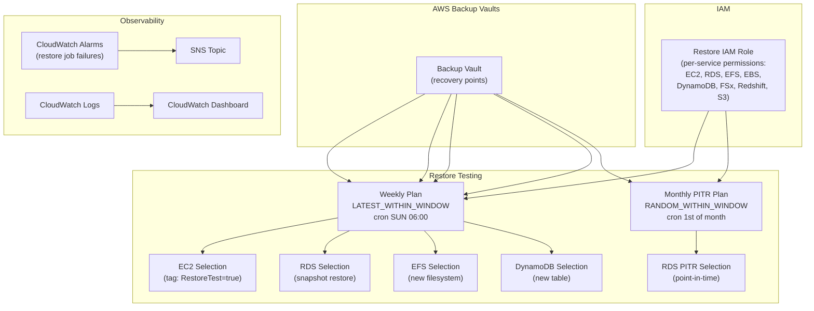

# tf-aws-restore Examples

Runnable examples for the [`tf-aws-restore`](../) Terraform module.

## Available Examples

| Example | Description |
|---------|-------------|
| [basic](basic/) | IAM role with configurable per-service restore permissions (EC2, RDS, EFS, EBS, DynamoDB, FSx, Redshift, S3), optional weekly restore testing plan for EC2 snapshots, CloudWatch alarms, and SNS notifications |
| [complete](complete/) | Full restore configuration with weekly snapshot and monthly PITR testing plans, restore testing selections for EC2, RDS (snapshot + PITR), EFS, and DynamoDB, CloudWatch logs and dashboard |

## Architecture



## Quick Start

```bash
cd basic/
terraform init
terraform apply -var-file="dev.tfvars"
```

For the full multi-service restore testing setup:

```bash
cd complete/
terraform init
terraform apply -var-file="dev.tfvars"
```
