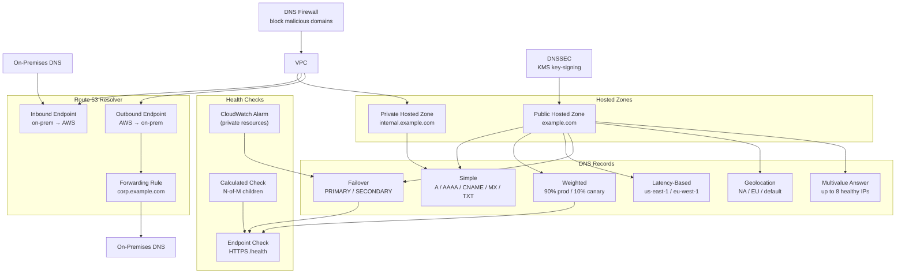

# tf-aws-route53

Terraform module for AWS Route 53 covering hosted zones, DNS records, health checks, DNSSEC, Route 53 Resolver, DNS Firewall, and CIDR-based routing.

## Scope

This module can manage:
- public and private hosted zones
- BYO hosted zones by existing `zone_id`
- reusable delegation sets
- DNS records with multiple routing policies
- Route 53 health checks
- DNSSEC for module-created zones
- Route 53 Resolver endpoints, rules, and associations
- Route 53 Resolver DNS Firewall rule groups and associations
- CIDR collections for IP-based routing

## Requirements

- Terraform `>= 1.3.0`
- AWS provider `>= 5.0`

## Features

- Create or reuse hosted zones with a zone-by-zone BYO pattern
- Support public and private hosted zones with VPC associations
- Support records for simple, weighted, latency, failover, geolocation, geoproximity, multivalue, and IP-based routing
- Support alias records for common AWS targets
- Support endpoint, calculated, and CloudWatch alarm health checks
- Support DNSSEC signing with Route 53 key-signing keys
- Support inbound and outbound Route 53 Resolver endpoints
- Support forwarding rules and VPC rule associations
- Support custom DNS Firewall domain lists, rule groups, and VPC associations

## Architecture



## Versioning

Review [CHANGELOG.md](CHANGELOG.md) before selecting a module version. Use explicit git tags such as `?ref=v1.0.0`, `?ref=v1.1.0`, or `?ref=v2.0.0` so deployments stay predictable.

## Usage

```hcl
module "route53" {
  source = "../tf-aws-route53"

  name        = "shared-dns"
  name_prefix = "prod"
  environment = "prod"

  zones = {
    public_main = {
      name = "example.com"
    }
    private_internal = {
      name         = "internal.example.com"
      private_zone = true
      vpc_ids      = ["vpc-0123456789abcdef0"]
    }
  }

  health_checks = {
    app_primary = {
      type          = "HTTPS"
      fqdn          = "app.example.com"
      port          = 443
      resource_path = "/health"
    }
  }

  records = {
    app = {
      zone_key          = "public_main"
      name              = "app"
      type              = "A"
      ttl               = 60
      records           = ["192.0.2.10"]
      set_identifier    = "primary"
      failover_role     = "PRIMARY"
      health_check_key  = "app_primary"
    }
  }
}
```

## Key Inputs

| Name | Description |
|------|-------------|
| `name` | Base name used to prefix resources created by the module. |
| `name_prefix` | Optional prefix for generated resource names. |
| `environment` | Environment tag value. |
| `tags` | Additional tags applied to resources. |
| `zones` | Hosted zones to create or reuse. |
| `create_delegation_sets` | Reusable delegation sets to create. |
| `records` | DNS records across all zones. |
| `health_checks` | Endpoint-based Route 53 health checks. |
| `calculated_health_checks` | Calculated health checks based on child checks. |
| `cloudwatch_alarm_health_checks` | CloudWatch alarm-backed health checks. |
| `dnssec_zones` | Zones for which DNSSEC should be enabled. |
| `resolver_endpoints` | Route 53 Resolver endpoints. |
| `resolver_rules` | Route 53 Resolver rules and VPC associations. |
| `dns_firewall_domain_lists` | Custom DNS Firewall domain lists. |
| `dns_firewall_rule_groups` | DNS Firewall rule groups and rules. |
| `dns_firewall_associations` | VPC associations for DNS Firewall rule groups. |
| `cidr_collections` | CIDR collections for IP-based routing. |

## Key Outputs

| Name | Description |
|------|-------------|
| `zone_ids` | Hosted zone IDs created by the module. |
| `effective_zone_ids` | Resolved zone IDs for both created and BYO zones. |
| `zone_name_servers` | Name servers for created public zones. |
| `record_fqdns` | FQDNs of created records. |
| `health_check_ids` | IDs of endpoint health checks. |
| `dnssec_ds_records` | DS records to publish at the parent zone or registrar. |
| `resolver_endpoint_ids` | Resolver endpoint IDs. |
| `resolver_rule_ids` | Resolver rule IDs. |
| `dns_firewall_rule_group_ids` | DNS Firewall rule group IDs. |
| `cidr_collection_ids` | CIDR collection IDs for IP-based routing. |

## Examples

- [Basic](examples/basic/)
- [Complete](examples/complete/)
- [Failover](examples/failover/)
- [RDS + ALB Paris/Frankfurt](examples/rds-alb-paris-frankfurt/)

## Notes

- DNSSEC only works for zones created by this module, not BYO zones.
- Route 53 DNSSEC KMS keys must be in `us-east-1`.
- Private hosted zones require VPC associations.
- Resolver endpoints should use at least two IPs in different AZs for high availability.
- Some advanced routing policies require `set_identifier` and additional policy-specific fields.
