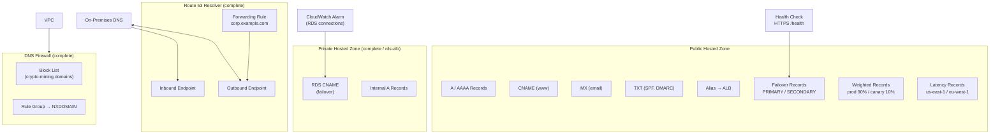

# tf-aws-route53 Examples

Runnable examples for the [`tf-aws-route53`](../) Terraform module.

## Available Examples

| Example | Description |
|---------|-------------|
| [basic](basic/) | Minimal configuration — single public hosted zone with common record types (A, AAAA, CNAME, MX, TXT, NS, CAA) |
| [complete](complete/) | Full feature showcase — public and private zones, delegation sets, all routing policies, alias records, health checks, DNSSEC, Route 53 Resolver endpoints and forwarding rules, and DNS Firewall |
| [failover](failover/) | Active-passive multi-region failover routing across us-east-1 and eu-west-1, combined with weighted canary deployments and latency-based routing |
| [rds-alb-paris-frankfurt](rds-alb-paris-frankfurt/) | Multi-service Paris/Frankfurt failover — ALB weighted records with health-check-driven automatic failover, and private-zone RDS CNAME failover driven by CloudWatch alarms |

## Architecture



## Quick Start

```bash
cd basic/
terraform init
terraform apply -var-file="dev.tfvars"
```
