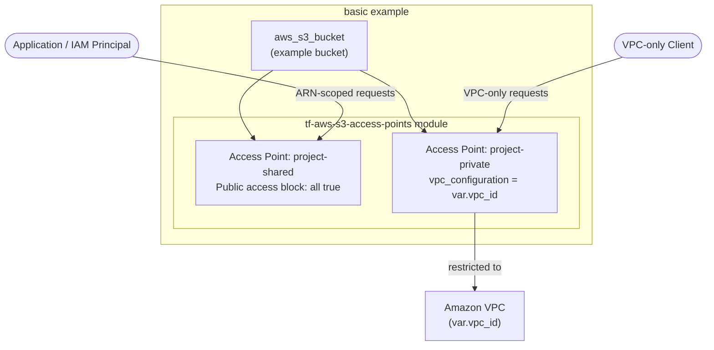

# tf-aws-s3-access-points — Examples

> Quick-start examples for the `tf-aws-s3-access-points` Terraform module.

## Available Examples

| Example | Description |
|---------|-------------|
| [basic](basic/) | Minimal config — creates an S3 bucket alongside two access points: a shared access point (all public access blocked) and a private VPC-restricted access point |

## Architecture



## Running an Example

```bash
cd basic
terraform init
terraform apply -var-file="dev.tfvars"
```
