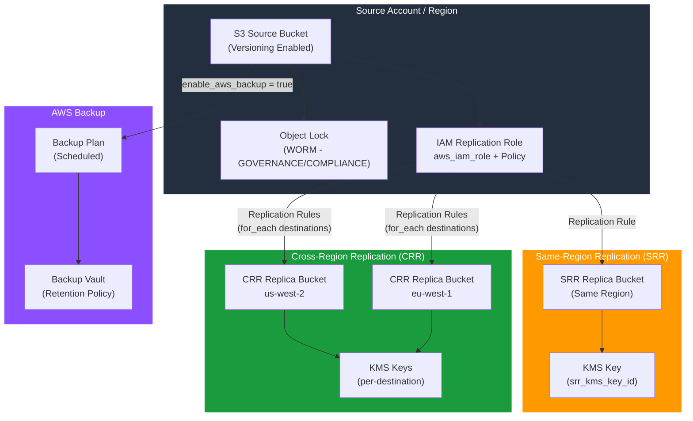

# tf-aws-s3-replication

Terraform module for S3 bucket with built-in backup strategies:
- **SRR** (Same-Region Replication) — backup copy in same region
- **CRR** (Cross-Region Replication) — one or more replica buckets in other regions
- **AWS Backup** — scheduled backup plan with configurable retention
- **Object Lock** — WORM immutable storage (GOVERNANCE or COMPLIANCE)

## Architecture



## Replication Modes

| Mode | Use Case | Config |
|------|----------|--------|
| SRR | Disaster recovery within same region | `enable_srr = true` |
| CRR | DR across regions, compliance | `enable_crr = true` + `crr_destinations` map |
| Both SRR + CRR | Maximum durability | Both enabled |
| AWS Backup | Point-in-time restore | `enable_aws_backup = true` |
| Object Lock (WORM) | Ransomware protection | `object_lock_enabled = true` |

## Versioning

Review [CHANGELOG.md](CHANGELOG.md) before selecting a module version. Use explicit git tags such as `?ref=v1.0.0`, `?ref=v1.1.0`, or `?ref=v2.0.0` so deployments stay predictable.
## Usage

```hcl
# SRR (Same-Region Backup)
module "s3_backup" {
  source             = "git::https://github.com/your-org/tf-modules.git//tf-aws-s3-replication?ref=v1.0.0"
  source_bucket_name = "prod-app-data"
  source_region      = "us-east-1"
  environment        = "prod"
  source_kms_key_id  = module.kms.key_arn

  enable_srr     = true
  srr_kms_key_id = module.kms.key_arn
}

# CRR (Cross-Region Replication to DR region)
module "s3_crr" {
  source             = "git::https://github.com/your-org/tf-modules.git//tf-aws-s3-replication?ref=v1.0.0"
  source_bucket_name = "prod-app-data"
  source_region      = "us-east-1"
  environment        = "prod"

  enable_crr = true
  crr_destinations = {
    us_west_dr = {
      bucket_arn = "arn:aws:s3:::prod-app-data-dr-us-west-2"
      region     = "us-west-2"
      kms_key_id = "arn:aws:kms:us-west-2:123456789:key/abc..."
    }
    eu_west_dr = {
      bucket_arn = "arn:aws:s3:::prod-app-data-dr-eu-west-1"
      region     = "eu-west-1"
    }
  }
}
```

## CRR Destination Bucket Setup

Destination buckets for CRR must be created separately in each region using the `tf-aws-s3` module with provider aliases:

```hcl
provider "aws" { alias = "dr"; region = "us-west-2" }

module "s3_dr_bucket" {
  source    = "./tf-aws-s3"
  providers = { aws = aws.dr }

  bucket_name        = "prod-app-data-dr-us-west-2"
  kms_master_key_id  = module.kms_dr.key_arn
  versioning_enabled = true   # Required for CRR destination
}
```

## Examples

- [Basic SRR](examples/srr/)
- [Complete CRR + AWS Backup](examples/complete/)

