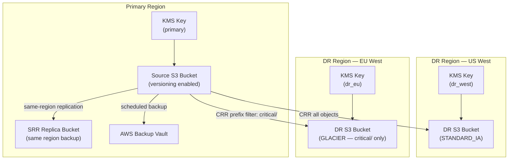

# tf-aws-s3-replication Examples

Runnable examples for the [`tf-aws-s3-replication`](../) Terraform module.

## Available Examples

| Example | Description |
|---------|-------------|
| [srr](srr/) | Same-Region Replication — creates a source bucket with SRR to a backup bucket in the same region, KMS encryption, AWS Backup, and lifecycle rules |
| [complete](complete/) | Full configuration with SRR, multi-destination Cross-Region Replication (US West + EU West), AWS Backup, Object Lock, and per-prefix replication filters across three AWS regions |

## Architecture



## Quick Start

```bash
# Same-region replication only
cd srr/
terraform init
terraform apply -var-file="dev.tfvars"

# Full multi-region setup
cd complete/
terraform init
terraform apply -var-file="dev.tfvars"
```
