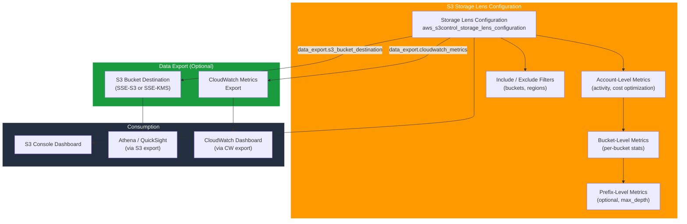

# tf-aws-s3-storage-lens

Terraform module for AWS S3 Storage Lens configuration.

## Architecture



## Scope

This module manages a single `aws_s3control_storage_lens_configuration` resource.

It is intended for:
- account-level Storage Lens metrics
- bucket-level metrics
- optional prefix-level metrics
- optional include and exclude filters
- optional CloudWatch and S3 export settings

## Requirements

- Terraform `>= 1.3.0`
- AWS provider `>= 5.0`

## Features

- Account-level Storage Lens configuration
- Bucket-level metrics toggles
- Optional prefix-level metrics
- Optional include and exclude filters
- Optional CloudWatch metrics export
- Optional S3 export destination with `SSE-S3` or `SSE-KMS` encryption
- Automatic fallback to the current caller account when `account_id` is not set

## Versioning

Review [CHANGELOG.md](CHANGELOG.md) before selecting a module version. Use explicit git tags such as `?ref=v1.0.0`, `?ref=v1.1.0`, or `?ref=v2.0.0` so deployments stay predictable.
## Usage

```hcl
module "storage_lens" {
  source = "../tf-aws-s3-storage-lens"

  config_id = "org-storage-lens"

  tags = {
    Environment = "prod"
    Terraform   = "true"
  }

  account_level = {
    activity_metrics                   = true
    advanced_cost_optimization_metrics = true
    bucket_level = {
      activity_metrics = true
      prefix_level = {
        storage_metrics = {
          enabled = true
          selection_criteria = {
            delimiter                    = "/"
            max_depth                    = 5
            min_storage_bytes_percentage = 1
          }
        }
      }
    }
  }

  include = {
    regions = ["us-east-1"]
  }
}
```

## Inputs

| Name | Type | Default | Description |
|------|------|---------|-------------|
| `account_id` | `string` | `null` | AWS account ID for the Storage Lens configuration. Defaults to the current caller account. |
| `config_id` | `string` | n/a | Identifier for the Storage Lens configuration. |
| `enabled` | `bool` | `true` | Whether the Storage Lens configuration is enabled. |
| `account_level` | `object(...)` | `{}` | Account-level metrics configuration, including bucket-level and optional prefix-level metrics. |
| `include` | `object(...)` | `null` | Optional include filter for buckets and Regions. |
| `exclude` | `object(...)` | `null` | Optional exclude filter for buckets and Regions. |
| `data_export` | `object(...)` | `null` | Optional export configuration for CloudWatch metrics and/or S3 bucket destination. |
| `tags` | `map(string)` | `{}` | Tags applied to the Storage Lens configuration. |

## Outputs

| Name | Description |
|------|-------------|
| `storage_lens_configuration_arn` | ARN of the Storage Lens configuration. |
| `storage_lens_configuration_id` | Configuration ID of the Storage Lens configuration. |

## Example

- [Basic example](examples/basic/)

## Notes

- This module manages one Storage Lens configuration per module instance.
- If `data_export.s3_bucket_destination.encryption.type = "SSE-KMS"`, `key_id` is required.
- The export destination bucket must already exist or be created in the same configuration.

