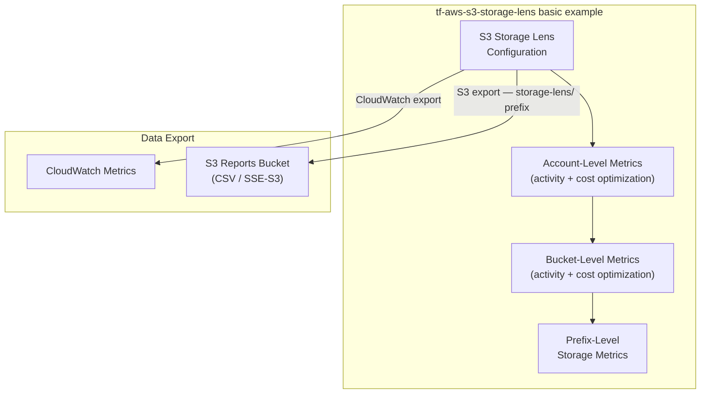

# tf-aws-s3-storage-lens Examples

Runnable examples for the [`tf-aws-s3-storage-lens`](../) Terraform module.

## Available Examples

| Example | Description |
|---------|-------------|
| [basic](basic/) | Minimal configuration — creates an S3 Storage Lens configuration with account-level and bucket-level activity metrics, advanced cost optimization metrics, prefix-level storage metrics, CloudWatch export, and CSV export to a dedicated S3 reports bucket |

## Architecture



## Quick Start

```bash
cd basic/
terraform init
terraform apply -var-file="dev.tfvars"
```
