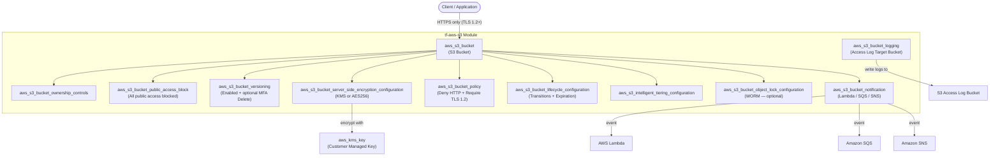

# tf-aws-s3

Terraform module for AWS S3 with security-hardened defaults.

## Features

- KMS or AES256 server-side encryption (bucket key enabled by default)
- Versioning with optional MFA delete
- Block all public access by default
- Mandatory deny-HTTP and require-TLS-1.2 bucket policies
- Access logging to a target bucket
- Flexible lifecycle rules (transitions + expiration)
- CORS rules
- Static website hosting
- S3 Object Lock (WORM)
- Cross-region replication
- Event notifications (Lambda / SQS / SNS)
- Intelligent-Tiering configuration
- `prevent_destroy` lifecycle guard

## Security Controls

| Control | Default |
|---------|---------|
| Server-side encryption | `aws:kms` |
| Block public access | All 4 settings = `true` |
| Deny HTTP requests | Yes |
| Require TLS 1.2+ | Yes |
| Versioning | Enabled |
| Access logging | Opt-in |
| Object Lock | Opt-in |

## Architecture



## Versioning

Review [CHANGELOG.md](CHANGELOG.md) before selecting a module version. Use explicit git tags such as `?ref=v1.0.0`, `?ref=v1.1.0`, or `?ref=v2.0.0` so deployments stay predictable.
## Usage

```hcl
module "s3" {
  source = "git::https://github.com/your-org/tf-modules.git//tf-aws-s3?ref=v1.0.0"

  bucket_name       = "my-app-data"
  environment       = "prod"
  kms_master_key_id = module.kms.key_arn
}
```

## Version Safety

- `prevent_destroy = true` prevents accidental deletion.
- Changing `bucket_name` creates a **new** bucket (S3 names are immutable). Plan carefully.
- Use `moved {}` if renaming the module block in calling code.

## Examples

- [Basic](examples/basic/)
- [Complete](examples/complete/) — KMS, lifecycle, logging, intelligent-tiering

