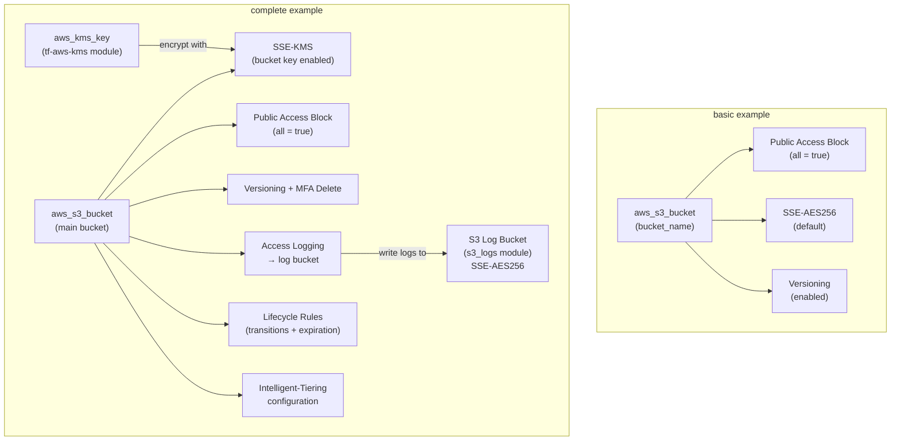

# tf-aws-s3 — Examples

> Quick-start examples for the `tf-aws-s3` Terraform module.

## Available Examples

| Example | Description |
|---------|-------------|
| [basic](basic/) | Minimal config — creates a single S3 bucket with default security settings (AES256 encryption, all public access blocked, versioning enabled) using only required tags |
| [complete](complete/) | Full config — S3 bucket with KMS encryption, versioning, MFA delete, access logging to a dedicated log bucket, lifecycle rules, Intelligent-Tiering, and all public access controls explicitly set |

## Architecture



## Running an Example

```bash
cd basic
terraform init
terraform apply -var-file="dev.tfvars"
```

```bash
cd complete
terraform init
terraform apply -var-file="dev.tfvars"
```
