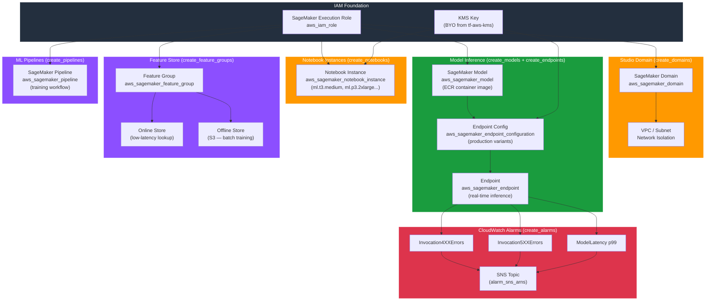

# tf-aws-sagemaker

Production-grade Terraform module for Amazon SageMaker. Manages Studio domains, notebook instances, models, endpoints, Feature Store feature groups, Pipelines, CloudWatch alarms, and the supporting IAM execution role — all under a single, opt-in interface.

---

## Architecture



---

## Features

- **Opt-in by default** — every resource family is gated behind a `create_X = false` flag; nothing is created unless explicitly enabled.
- **BYO foundational resources** — pass an existing IAM role ARN (`role_arn`) or KMS key ARN (`kms_key_arn`) produced by companion modules (`tf-aws-iam`, `tf-aws-kms`), or let this module auto-create them.
- **`for_each` everywhere** — all primary resources are driven by maps, eliminating count-based index drift.
- **No main.tf** — resources are split by service area into named files (`domains.tf`, `notebooks.tf`, `models.tf`, `endpoints.tf`, `feature_store.tf`, `pipelines.tf`, `iam.tf`, `alarms.tf`) for easy navigation.
- **Input validation** — `auth_mode`, `instance_type` format, and feature `feature_type` values are validated at plan time.
- **Tag inheritance** — module-level tags are merged with per-resource tags; `ManagedBy` and `Module` are always stamped.

---

## Versioning

Review [CHANGELOG.md](CHANGELOG.md) before selecting a module version. Use explicit git tags such as `?ref=v1.0.0`, `?ref=v1.1.0`, or `?ref=v2.0.0` so deployments stay predictable.
## Usage

### Minimal (IAM role only)

```hcl
module "sagemaker" {
  source = "./tf-aws-sagemaker"

  name_prefix = "myapp-dev"

  tags = {
    Environment = "dev"
    Team        = "ml-platform"
  }
}
```

Only the IAM execution role is created. All SageMaker resource families remain disabled.

---

### With Notebook Instances

```hcl
module "sagemaker" {
  source = "./tf-aws-sagemaker"

  name_prefix      = "myapp-dev"
  create_notebooks = true

  notebooks = {
    "research" = {
      instance_type     = "ml.t3.medium"
      volume_size_in_gb = 50
      subnet_id         = "subnet-0abc123"
      security_groups   = ["sg-0def456"]
    }
    "training" = {
      instance_type     = "ml.p3.2xlarge"
      volume_size_in_gb = 100
    }
  }

  tags = {
    Environment = "dev"
  }
}
```

---

### With Models and Endpoints

```hcl
module "sagemaker" {
  source = "./tf-aws-sagemaker"

  name_prefix      = "myapp-prod"
  create_models    = true
  create_endpoints = true

  models = {
    "classifier" = {
      primary_container_image = "123456789012.dkr.ecr.us-east-1.amazonaws.com/my-model:latest"
      model_data_url          = "s3://my-bucket/models/classifier/model.tar.gz"
      environment = {
        SAGEMAKER_PROGRAM = "inference.py"
      }
    }
  }

  endpoint_configs = {
    "classifier-config" = {
      production_variants = [
        {
          variant_name           = "primary"
          model_name             = "myapp-prod-classifier"
          instance_type          = "ml.m5.large"
          initial_instance_count = 2
          initial_variant_weight = 1.0
        }
      ]
    }
  }

  endpoints = {
    "classifier" = {
      endpoint_config_name = "myapp-prod-classifier-config"
    }
  }

  kms_key_arn = "arn:aws:kms:us-east-1:123456789012:key/mrk-abc123"

  tags = {
    Environment = "prod"
  }
}
```

---

### With CloudWatch Alarms

```hcl
module "sagemaker" {
  source = "./tf-aws-sagemaker"

  name_prefix      = "myapp-prod"
  create_endpoints = true
  create_alarms    = true

  endpoints = {
    "classifier" = {
      endpoint_config_name = "myapp-prod-classifier-config"
    }
  }

  alarm_sns_arns = ["arn:aws:sns:us-east-1:123456789012:ml-alerts"]

  tags = {
    Environment = "prod"
  }
}
```

Three alarms are created per endpoint: `Invocation4XXErrors`, `Invocation5XXErrors`, and `ModelLatency` (p99).

---

### BYO IAM Role Pattern

Use this pattern when the IAM role is managed by a separate `tf-aws-iam` module:

```hcl
module "iam" {
  source = "./tf-aws-iam"
  # ... produces role_arn output
}

module "sagemaker" {
  source = "./tf-aws-sagemaker"

  name_prefix     = "myapp-prod"
  create_iam_role = false
  role_arn        = module.iam.role_arn

  create_notebooks = true
  notebooks = {
    "research" = {
      instance_type = "ml.t3.medium"
    }
  }
}
```

---

### Feature Store

```hcl
module "sagemaker" {
  source = "./tf-aws-sagemaker"

  name_prefix           = "myapp-prod"
  create_feature_groups = true

  feature_groups = {
    "customer-features" = {
      record_identifier_name  = "customer_id"
      event_time_feature_name = "event_time"
      enable_online_store     = true
      enable_offline_store    = true
      s3_offline_store_uri    = "s3://my-feature-store-bucket/customer-features"
      features = [
        { name = "customer_id",    feature_type = "String"   },
        { name = "event_time",     feature_type = "String"   },
        { name = "age",            feature_type = "Integral" },
        { name = "lifetime_value", feature_type = "Fractional" }
      ]
    }
  }
}
```

---

## Inputs

### Feature Gates

| Name | Type | Default | Description |
|------|------|---------|-------------|
| `create_domains` | `bool` | `false` | Create SageMaker Studio domains. |
| `create_notebooks` | `bool` | `false` | Create SageMaker notebook instances. |
| `create_models` | `bool` | `false` | Create SageMaker models. |
| `create_endpoints` | `bool` | `false` | Create SageMaker endpoints and endpoint configs. |
| `create_feature_groups` | `bool` | `false` | Create SageMaker Feature Store feature groups. |
| `create_pipelines` | `bool` | `false` | Create SageMaker Pipelines. |
| `create_alarms` | `bool` | `false` | Create CloudWatch alarms for SageMaker endpoints. |
| `create_iam_role` | `bool` | `true` | Auto-create SageMaker execution role. |

### BYO Resources

| Name | Type | Default | Description |
|------|------|---------|-------------|
| `role_arn` | `string` | `null` | Existing IAM role ARN. Used when `create_iam_role = false`. |
| `kms_key_arn` | `string` | `null` | KMS key ARN for encryption of notebooks, endpoint configs. |

### Global

| Name | Type | Default | Description |
|------|------|---------|-------------|
| `name_prefix` | `string` | `""` | Prefix prepended to all resource names. |
| `tags` | `map(string)` | `{}` | Tags applied to all resources. |

### Per-Resource

| Name | Type | Default | Description |
|------|------|---------|-------------|
| `domains` | `map(object)` | `{}` | SageMaker Studio domain definitions. |
| `notebooks` | `map(object)` | `{}` | Notebook instance definitions. |
| `models` | `map(object)` | `{}` | SageMaker model definitions. |
| `endpoint_configs` | `map(object)` | `{}` | Endpoint configuration definitions. |
| `endpoints` | `map(object)` | `{}` | Endpoint definitions. |
| `feature_groups` | `map(object)` | `{}` | Feature Store feature group definitions. |
| `pipelines` | `map(object)` | `{}` | SageMaker Pipeline definitions. |
| `alarm_sns_arns` | `list(string)` | `[]` | SNS topic ARNs for CloudWatch alarm notifications. |

---

## Outputs

| Name | Description |
|------|-------------|
| `domain_ids` | Map of domain key to domain ID. |
| `domain_arns` | Map of domain key to domain ARN. |
| `notebook_arns` | Map of notebook key to notebook ARN. |
| `notebook_urls` | Map of notebook key to notebook URL. |
| `model_arns` | Map of model key to model ARN. |
| `endpoint_arns` | Map of endpoint key to endpoint ARN. |
| `endpoint_config_arns` | Map of endpoint config key to endpoint configuration ARN. |
| `feature_group_arns` | Map of feature group key to feature group ARN. |
| `pipeline_arns` | Map of pipeline key to pipeline ARN. |
| `iam_role_arn` | ARN of the SageMaker execution role (auto-created or BYO). |
| `iam_role_name` | Name of the auto-created execution role. `null` when BYO. |

---

## BYO Pattern

This module follows the **Bring Your Own (BYO)** pattern for foundational infrastructure:

| Resource | Auto-create (default) | BYO override |
|----------|----------------------|--------------|
| IAM Role | `create_iam_role = true` (default) | Set `create_iam_role = false` and supply `role_arn` |
| KMS Key | No key used by default | Supply `kms_key_arn` from `tf-aws-kms` or any source |

This allows you to compose this module with dedicated IAM and KMS modules without creating duplicate foundational resources:

```
tf-aws-iam    ──► role_arn    ──►  tf-aws-sagemaker
tf-aws-kms    ──► kms_key_arn ──►  tf-aws-sagemaker
```

---

## Requirements

| Name | Version |
|------|---------|
| Terraform | >= 1.3.0 |
| AWS Provider | >= 5.0 |

---

## License

Apache 2.0
