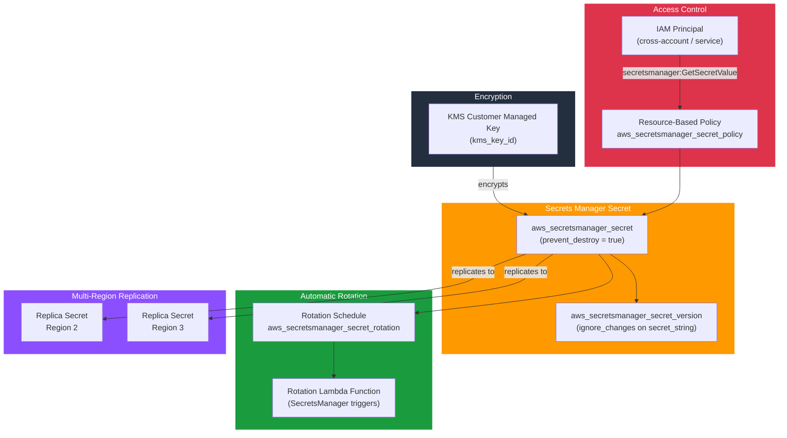

# tf-aws-secretsmanager

Terraform module for AWS Secrets Manager.

## Architecture



## Features

- KMS encryption (customer-managed)
- Automatic rotation via Lambda
- Multi-region replication
- Resource-based policy
- `prevent_destroy` lifecycle guard
- `ignore_changes` on secret value (value managed externally after initial creation)

## Security Controls

| Control | Default |
|---------|---------|
| KMS encryption | Optional (strongly recommended) |
| Recovery window | 30 days |
| `prevent_destroy` | `true` |
| Secret value ignored on re-apply | `ignore_changes = [secret_string]` |

## Versioning

Review [CHANGELOG.md](CHANGELOG.md) before selecting a module version. Use explicit git tags such as `?ref=v1.0.0`, `?ref=v1.1.0`, or `?ref=v2.0.0` so deployments stay predictable.
## Usage

```hcl
module "secret" {
  source     = "git::https://github.com/your-org/tf-modules.git//tf-aws-secretsmanager?ref=v1.0.0"
  name       = "prod/app/database"
  kms_key_id = module.kms.key_arn
  environment = "prod"
}
```
