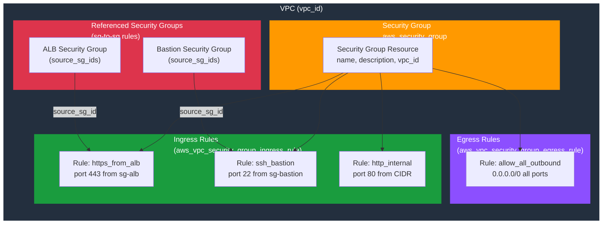

# tf-aws-security-group

Terraform module for AWS Security Groups with individually managed rules.

## Architecture



## Features

- Security group with per-rule resources (`aws_vpc_security_group_ingress_rule` / `aws_vpc_security_group_egress_rule`)
- Rule map keyed by name → stable lifecycle, no index-based replacements
- `create_before_destroy = true` for zero-downtime rule changes
- Default: deny all inbound, allow all outbound
- Full tagging

## Versioning

Review [CHANGELOG.md](CHANGELOG.md) before selecting a module version. Use explicit git tags such as `?ref=v1.0.0`, `?ref=v1.1.0`, or `?ref=v2.0.0` so deployments stay predictable.
## Usage

```hcl
module "sg" {
  source      = "git::https://github.com/your-org/tf-modules.git//tf-aws-security-group?ref=v1.0.0"

  name        = "app-server"
  vpc_id      = module.vpc.vpc_id
  environment = "prod"

  ingress_rules = {
    https_from_alb = {
      from_port     = 443
      to_port       = 443
      protocol      = "tcp"
      source_sg_ids = [module.alb_sg.security_group_id]
      description   = "HTTPS from ALB"
    }
  }
}
```
