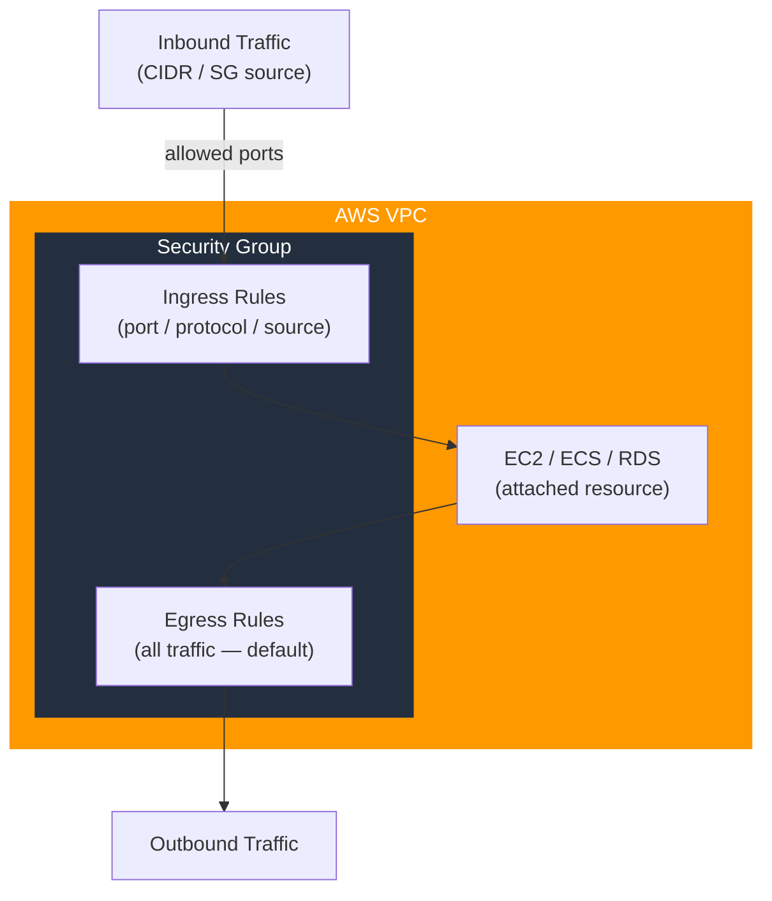

# tf-aws-security-group Examples

Runnable examples for the [`tf-aws-security-group`](../) Terraform module.

## Available Examples

| Example | Description |
|---------|-------------|
| [basic](basic/) | Single security group in a VPC with configurable ingress rules, standard tagging, and no egress restrictions |

## Architecture



## Quick Start

```bash
cd basic/
terraform init
terraform apply -var-file="dev.tfvars"
```
