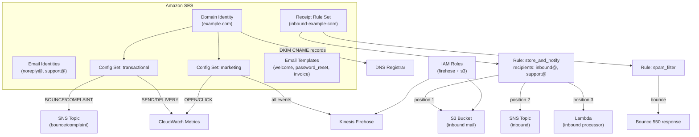

# tf-aws-ses Examples

Runnable examples for the [`tf-aws-ses`](../) Terraform module.

## Available Examples

| Example | Description |
|---------|-------------|
| [minimal](minimal/) | Minimal configuration — single verified domain with DKIM signing only; no configuration sets, receipt rules, templates, or IAM roles |
| [complete](complete/) | Full configuration with multiple domain and email identities, transactional and marketing configuration sets, SNS/CloudWatch/Firehose event destinations, inbound receipt rules, email templates, and auto-created IAM roles |

## Architecture



## Quick Start

```bash
cd minimal/
terraform init
terraform apply
```

For the complete example, supply the required variable values first:

```bash
cd complete/
terraform init
terraform apply \
  -var="inbound_bucket_name=my-ses-inbound" \
  -var="sns_bounce_topic_arn=arn:aws:sns:us-east-1:123456789012:ses-bounces" \
  -var="sns_inbound_topic_arn=arn:aws:sns:us-east-1:123456789012:ses-inbound" \
  -var="firehose_stream_arn=arn:aws:firehose:us-east-1:123456789012:deliverystream/ses-marketing" \
  -var="inbound_processor_lambda_arn=arn:aws:lambda:us-east-1:123456789012:function:ses-processor"
```
