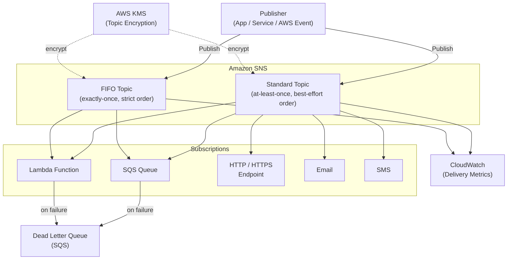

# tf-aws-sns

Terraform module for AWS SNS topics (Standard and FIFO).

## Features

- Standard and FIFO topics
- KMS encryption
- Subscriptions map (SQS, Lambda, HTTP/HTTPS, email, SMS)
- Filter policies per subscription
- `prevent_destroy` lifecycle guard

## Architecture



## Security Controls

- KMS encryption at rest (AWS-managed or customer-managed key)
- `prevent_destroy` lifecycle guard on topics
- Per-subscription filter policies to limit fan-out blast radius

## Versioning

Review [CHANGELOG.md](CHANGELOG.md) before selecting a module version. Use explicit git tags such as `?ref=v1.0.0`, `?ref=v1.1.0`, or `?ref=v2.0.0` so deployments stay predictable.

## Usage

```hcl
module "sns" {
  source            = "git::https://github.com/your-org/tf-modules.git//tf-aws-sns?ref=v1.0.0"
  name              = "order-events"
  environment       = "prod"
  kms_master_key_id = module.kms.key_id

  subscriptions = {
    sqs = {
      protocol = "sqs"
      endpoint = module.sqs.queue_arn
    }
  }
}
```

