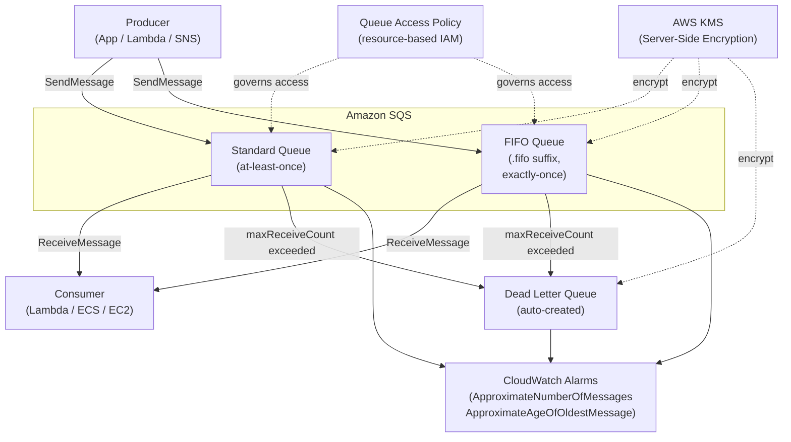

# tf-aws-sqs

Terraform module for AWS SQS queues (Standard and FIFO).

## Features

- Standard and FIFO queues
- KMS encryption (customer-managed or AWS-managed)
- Dead Letter Queue auto-created by default
- `prevent_destroy` lifecycle guard
- Queue policy support

## Architecture



## Security Controls

- KMS encryption (AWS-managed `alias/aws/sqs` or customer-managed key)
- Resource-based queue access policy for cross-account or cross-service access
- `prevent_destroy` lifecycle guard on main queues
- DLQ redrive policy enforces max receive count before dead-lettering

## Versioning

Review [CHANGELOG.md](CHANGELOG.md) before selecting a module version. Use explicit git tags such as `?ref=v1.0.0`, `?ref=v1.1.0`, or `?ref=v2.0.0` so deployments stay predictable.

## Usage

```hcl
module "queue" {
  source            = "git::https://github.com/your-org/tf-modules.git//tf-aws-sqs?ref=v1.0.0"
  name              = "order-processing"
  environment       = "prod"
  kms_master_key_id = module.kms.key_id
}
```

