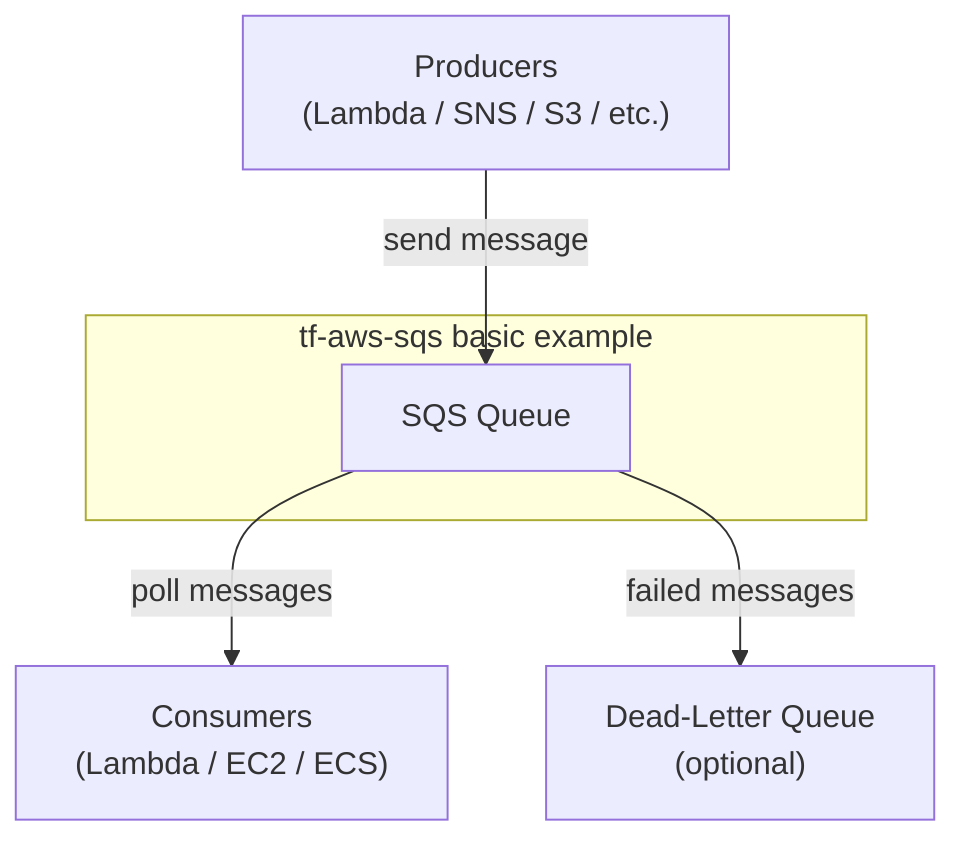

# tf-aws-sqs Examples

Runnable examples for the [`tf-aws-sqs`](../) Terraform module.

## Available Examples

| Example | Description |
|---------|-------------|
| [basic](basic/) | Minimal configuration — creates an SQS queue with standard tagging (name, environment, project, owner, cost center) |

## Architecture



## Quick Start

```bash
cd basic/
terraform init
terraform apply -var-file="dev.tfvars"
```
