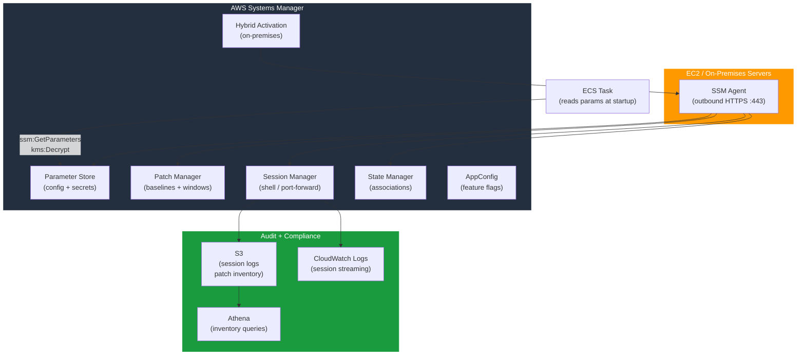

# tf-aws-ssm Examples

Runnable examples for the [`tf-aws-ssm`](../) Terraform module.

Each example is self-contained with its own `main.tf` and `README.md`.

## Available Examples

| Example | Description |
|---------|-------------|
| [01-web-app-parameter-store](01-web-app-parameter-store/) | Three-tier fintech app — stores all config and secrets in SSM Parameter Store using String, SecureString, and StringList types across database, API keys, application, and infrastructure namespaces |
| [02-fleet-patch-management](02-fleet-patch-management/) | Enterprise EC2 fleet of 200 mixed Linux and Windows instances — six patch baselines (per-OS per-environment), nine patch groups, and five maintenance windows with scan-then-install tasks and rate controls |
| [03-session-manager-no-bastion](03-session-manager-no-bastion/) | Replaces EC2 bastion host with Session Manager — zero inbound ports, IAM-scoped access by EC2 tag, full session recording to S3 and CloudWatch Logs, and port forwarding to RDS and Redis |
| [04-appconfig-feature-flags](04-appconfig-feature-flags/) | SaaS feature flag management with AppConfig — gradual LINEAR rollout, auto-rollback on CloudWatch alarm, JSON Schema validation, and three configuration profiles across dev, staging, and prod environments |
| [05-hybrid-on-premises](05-hybrid-on-premises/) | Hybrid activation for 50 on-premises Windows factory servers — SSM Hybrid, OT-safe patch baseline with 14-day approval delay, Session Manager replacing VPN and RDP, State Manager security enforcement, and Resource Data Sync to S3 for Athena compliance reporting |

## Architecture



## Quick Start

Navigate into any numbered example directory and run:

```bash
cd 01-web-app-parameter-store/
terraform init
terraform apply
```
