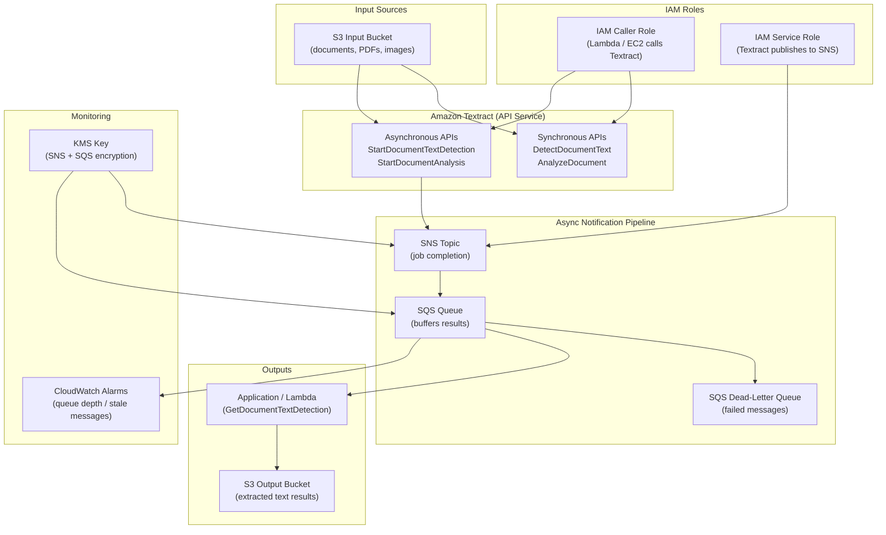

# tf-aws-textract

Terraform module for provisioning the surrounding infrastructure required to use **Amazon Textract** in production.

> **Important:** Amazon Textract is a pure API service — there are no `aws_textract_*` Terraform resources in the AWS provider. You cannot "create" a Textract endpoint; it is always available in your account. This module provisions the IAM roles, SNS topics, SQS queues, and CloudWatch alarms that your applications need to call the Textract API and receive async job results.

---

## What this module provisions

| Component | Resource | Purpose |
|-----------|----------|---------|
| IAM Caller Role | `aws_iam_role.textract` | Role assumed by Lambda/EC2 to call Textract APIs |
| IAM Service Role | `aws_iam_role.textract_service` | Role assumed by Textract itself to publish to SNS |
| SNS Topics | `aws_sns_topic.textract` | Async job completion notifications |
| SQS Queues | `aws_sqs_queue.textract` | Receive and buffer Textract results |
| SQS DLQs | `aws_sqs_queue.textract_dlq` | Dead-letter queues for failed processing |
| CloudWatch Alarms | `aws_cloudwatch_metric_alarm.*` | Queue depth and stale message monitoring |

---

## Architecture



### Async Text Extraction Flow

```
┌──────────────┐    StartDocumentTextDetection    ┌────────────────────┐
│  S3 Bucket   │ ─────────────────────────────── ▶│  Amazon Textract   │
│ (input docs) │                                   │    API Service     │
└──────────────┘                                   └────────┬───────────┘
                                                            │
                                              Job completes │ SNS notification
                                                            ▼
                                                   ┌────────────────┐
                                                   │   SNS Topic    │
                                                   │ (textract-*)   │
                                                   └───────┬────────┘
                                                           │ subscribed
                                                           ▼
                                                   ┌────────────────┐
                                                   │   SQS Queue    │
                                                   │ (textract-*)   │
                                                   └───────┬────────┘
                                                           │ triggers
                                                           ▼
                                                   ┌────────────────┐
                                                   │    Lambda      │
                                                   │  (processor)   │
                                                   └───────┬────────┘
                                                           │ GetDocumentTextDetection
                                                           ▼
                                                   ┌────────────────┐
                                                   │   S3 Bucket    │
                                                   │ (output/results│
                                                   └────────────────┘
```

### Sync vs Async Usage Patterns

**Synchronous** (small documents, < 5 pages):
- Use `DetectDocumentText` or `AnalyzeDocument` directly
- Response returned inline — no SNS/SQS needed
- Only requires the IAM caller role

**Asynchronous** (large documents, multi-page PDFs, TIFF files):
- Use `StartDocumentTextDetection` / `StartDocumentAnalysis`
- Textract processes in background and publishes to SNS when done
- Application polls SQS or subscribes Lambda to SQS for results
- Requires: IAM caller role + IAM service role + SNS topics + SQS queues

---

## Versioning

Review [CHANGELOG.md](CHANGELOG.md) before selecting a module version. Use explicit git tags such as `?ref=v1.0.0`, `?ref=v1.1.0`, or `?ref=v2.0.0` so deployments stay predictable.
## Usage

### Minimal — sync calls only (IAM role only)

```hcl
module "textract" {
  source = "./tf-aws-textract"

  name_prefix = "myapp"

  s3_input_bucket_arns = [module.docs_bucket.bucket_arn]

  tags = {
    Environment = "production"
    Team        = "platform"
  }
}
```

### Full async pipeline — SNS + SQS + alarms

```hcl
module "textract" {
  source = "./tf-aws-textract"

  name_prefix = "myapp"

  # IAM
  s3_input_bucket_arns  = [module.docs_bucket.bucket_arn]
  s3_output_bucket_arns = [module.results_bucket.bucket_arn]
  trusted_principals    = ["arn:aws:iam::123456789012:role/myapp-lambda-role"]

  # Async pipeline
  create_sns_topics = true
  sns_topics = {
    jobs = {
      display_name = "Textract Job Completion"
    }
  }

  create_sqs_queues = true
  sqs_queues = {
    results = {
      visibility_timeout_seconds = 300
      message_retention_seconds  = 86400
      create_dlq                 = true
    }
  }

  # Monitoring
  create_alarms  = true
  alarm_sns_arns = [aws_sns_topic.ops_alerts.arn]

  # KMS encryption (from tf-aws-kms)
  kms_key_arn = module.kms.key_arn

  tags = {
    Environment = "production"
  }
}

# Wire SNS → SQS subscription
resource "aws_sns_topic_subscription" "textract_to_sqs" {
  topic_arn = module.textract.sns_topic_arns["jobs"]
  protocol  = "sqs"
  endpoint  = module.textract.sqs_queue_arns["results"]
}

# Pass the service role ARN to StartDocumentTextDetection
locals {
  textract_notification_channel = {
    RoleArn   = module.textract.iam_service_role_arn
    SNSTopicArn = module.textract.sns_topic_arns["jobs"]
  }
}
```

### BYO IAM Role (from tf-aws-iam)

```hcl
module "textract" {
  source = "./tf-aws-textract"

  name_prefix     = "myapp"
  create_iam_role = false
  role_arn        = module.iam.role_arns["textract-caller"]

  create_sns_topics = true
  sns_topics = {
    async = {}
  }
}
```

### BYO KMS Key (from tf-aws-kms)

```hcl
module "textract" {
  source = "./tf-aws-textract"

  name_prefix = "myapp"
  kms_key_arn = module.kms.key_arn  # Automatically applied to all SNS + SQS resources

  create_sns_topics = true
  sns_topics = {
    jobs = {
      display_name = "Textract Jobs — encrypted"
      # kms_master_key_id omitted: falls back to var.kms_key_arn automatically
    }
  }

  create_sqs_queues = true
  sqs_queues = {
    results = {
      create_dlq = true
      # kms_master_key_id omitted: falls back to var.kms_key_arn automatically
    }
  }
}
```

---

## Inputs

| Name | Description | Type | Default | Required |
|------|-------------|------|---------|----------|
| `create_iam_role` | Auto-create IAM role for Textract API access | `bool` | `true` | no |
| `create_sns_topics` | Create SNS topics for async job notifications | `bool` | `false` | no |
| `create_sqs_queues` | Create SQS queues for Textract results | `bool` | `false` | no |
| `create_alarms` | Create CloudWatch alarms for monitoring | `bool` | `false` | no |
| `role_arn` | BYO IAM role ARN (when `create_iam_role = false`) | `string` | `null` | no |
| `kms_key_arn` | KMS key ARN for SNS/SQS encryption | `string` | `null` | no |
| `name_prefix` | Prefix for all resource names | `string` | `""` | no |
| `tags` | Tags applied to all resources | `map(string)` | `{}` | no |
| `sns_topics` | Map of SNS topic configurations | `map(object)` | `{}` | no |
| `sqs_queues` | Map of SQS queue configurations | `map(object)` | `{}` | no |
| `trusted_principals` | Extra IAM principals that can assume the caller role | `list(string)` | `[]` | no |
| `s3_input_bucket_arns` | S3 bucket ARNs Textract reads documents from | `list(string)` | `[]` | no |
| `s3_output_bucket_arns` | S3 bucket ARNs Textract writes results to | `list(string)` | `[]` | no |
| `alarm_sns_arns` | SNS ARNs for CloudWatch alarm notifications | `list(string)` | `[]` | no |

---

## Outputs

| Name | Description |
|------|-------------|
| `iam_role_arn` | ARN of the effective IAM caller role |
| `iam_role_name` | Name of the auto-created IAM caller role |
| `iam_service_role_arn` | ARN of the Textract service role (for NotificationChannel) |
| `iam_service_role_name` | Name of the Textract service role |
| `sns_topic_arns` | Map of topic key → ARN |
| `sns_topic_names` | Map of topic key → name |
| `sqs_queue_urls` | Map of queue key → URL |
| `sqs_queue_arns` | Map of queue key → ARN |
| `sqs_queue_names` | Map of queue key → name |
| `sqs_dlq_arns` | Map of queue key → DLQ ARN (only keys with `create_dlq = true`) |
| `sqs_dlq_urls` | Map of queue key → DLQ URL (only keys with `create_dlq = true`) |
| `cloudwatch_alarm_arns` | Map of alarm name → ARN |

---

## Requirements

| Name | Version |
|------|---------|
| terraform | >= 1.3.0 |
| aws | >= 5.0 |

---

## Notes

- **Textract pricing:** Charged per page analyzed. There are no standing costs for the API itself — only per-call charges. SNS/SQS resources in this module have minimal cost at low volumes.
- **Async job result retrieval:** After receiving an SNS/SQS notification, call `GetDocumentTextDetection` or `GetDocumentAnalysis` with the `JobId` from the notification payload.
- **Service role ARN:** Pass `iam_service_role_arn` output as the `RoleArn` in the `NotificationChannel` parameter of `StartDocumentTextDetection` / `StartDocumentAnalysis` API calls.
- **S3 permissions:** This module grants the IAM role `s3:GetObject` on input buckets. Ensure the S3 bucket policy also allows Textract to read (add `textract.amazonaws.com` as a principal if using bucket policies).

