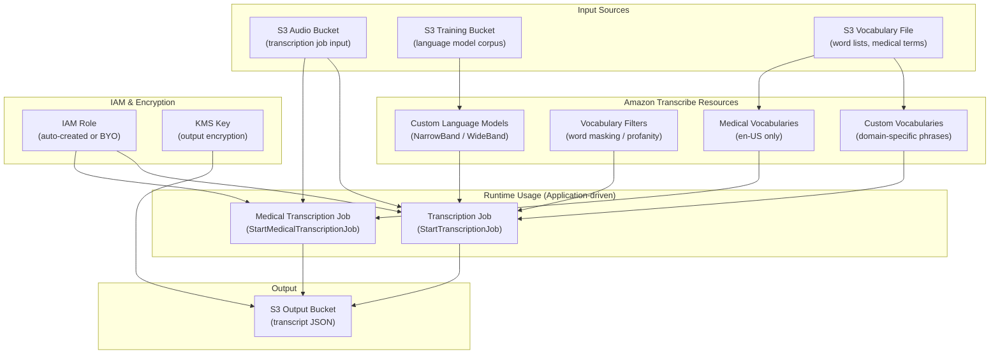

# tf-aws-transcribe

A production-grade Terraform module for managing [Amazon Transcribe](https://aws.amazon.com/transcribe/) resources including custom vocabularies, vocabulary filters, custom language models, and medical vocabularies.

## Features

- **Choice-based / opt-in** — every resource type is behind a boolean feature gate (default `false`). A minimal invocation creates nothing except an IAM role.
- **BYO (Bring Your Own) pattern** — supply your own IAM role ARN from [tf-aws-iam](../tf-aws-iam/) instead of auto-creating one.
- **`for_each` everywhere** — all resource maps use `for_each` for clean state and independent lifecycle management.
- **KMS encryption** — pass a KMS key ARN from [tf-aws-kms](../tf-aws-kms/) to enable output encryption.
- **Tag inheritance** — module-level tags are merged with per-resource tags on every resource.

## Requirements

| Name | Version |
|------|---------|
| terraform | >= 1.3.0 |
| aws | >= 5.0 |

## Versioning

Review [CHANGELOG.md](CHANGELOG.md) before selecting a module version. Use explicit git tags such as `?ref=v1.0.0`, `?ref=v1.1.0`, or `?ref=v2.0.0` so deployments stay predictable.
## Usage

### Minimal (IAM role only)

```hcl
module "transcribe" {
  source = "../tf-aws-transcribe"

  name_prefix = "myapp"
  tags        = { Environment = "production" }
}
```

Nothing is created except an IAM role with Transcribe + S3 permissions.

### Custom vocabularies (call-centre use case)

```hcl
module "transcribe" {
  source = "../tf-aws-transcribe"

  name_prefix         = "callcenter"
  create_vocabularies = true

  vocabularies = {
    product-terms = {
      language_code = "en-US"
      phrases       = ["AWS", "EC2", "Lambda", "S3 bucket", "CloudFormation"]
      tags          = { UseCase = "call-center" }
    }
    spanish-terms = {
      language_code = "es-US"
      phrases       = ["hola", "gracias", "por favor"]
    }
  }

  tags = { Environment = "production", Team = "cx-engineering" }
}

output "vocabulary_arns" {
  value = module.transcribe.vocabulary_arns
}
```

### Vocabulary filters (word masking)

```hcl
module "transcribe" {
  source = "../tf-aws-transcribe"

  name_prefix               = "myapp"
  create_vocabulary_filters = true

  vocabulary_filters = {
    profanity-filter = {
      language_code = "en-US"
      words         = ["word1", "word2"]
    }
    # Or use a pre-built S3 word list:
    extended-filter = {
      language_code              = "en-US"
      vocabulary_filter_file_uri = "s3://my-bucket/filters/extended.txt"
    }
  }
}
```

### Custom language models

Custom language models use domain-specific training data stored in S3. Training can take hours.

```hcl
module "transcribe" {
  source = "../tf-aws-transcribe"

  name_prefix            = "fintech"
  create_language_models = true

  language_models = {
    financial-model = {
      language_code   = "en-US"
      base_model_name = "WideBand"          # phone audio = NarrowBand
      s3_uri          = "s3://my-training-bucket/financial-corpus/"
      tuning_data_s3_uri = "s3://my-training-bucket/financial-tuning/"
    }
  }
}
```

### Medical transcription vocabularies

Only `en-US` is supported for medical vocabularies.

```hcl
module "transcribe" {
  source = "../tf-aws-transcribe"

  name_prefix                 = "healthco"
  create_medical_vocabularies = true

  medical_vocabularies = {
    cardiology-terms = {
      language_code       = "en-US"
      vocabulary_file_uri = "s3://my-bucket/medical/cardiology.csv"
      tags                = { Department = "cardiology" }
    }
  }

  tags = { HIPAA = "true", Environment = "production" }
}
```

### BYO IAM role (from tf-aws-iam)

```hcl
module "iam" {
  source = "../tf-aws-iam"
  # ... your existing IAM module configuration
}

module "transcribe" {
  source = "../tf-aws-transcribe"

  create_iam_role     = false
  role_arn            = module.iam.role_arn   # BYO from tf-aws-iam

  create_vocabularies = true
  vocabularies = {
    my-vocab = {
      language_code = "en-US"
      phrases       = ["term1", "term2"]
    }
  }
}
```

### With KMS encryption (from tf-aws-kms)

```hcl
module "kms" {
  source = "../tf-aws-kms"
  # ... your existing KMS module configuration
}

module "transcribe" {
  source = "../tf-aws-transcribe"

  kms_key_arn = module.kms.key_arn

  create_vocabularies = true
  vocabularies = {
    secure-vocab = {
      language_code = "en-US"
      phrases       = ["confidential", "internal"]
    }
  }
}
```

### Everything enabled

```hcl
module "transcribe" {
  source = "../tf-aws-transcribe"

  name_prefix                 = "enterprise"
  create_vocabularies         = true
  create_vocabulary_filters   = true
  create_language_models      = true
  create_medical_vocabularies = true
  kms_key_arn                 = "arn:aws:kms:us-east-1:123456789012:key/mrk-abc123"

  vocabularies = {
    general = {
      language_code = "en-US"
      phrases       = ["AWS", "Terraform", "DevOps"]
    }
  }

  vocabulary_filters = {
    banned = {
      language_code = "en-US"
      words         = ["word1", "word2"]
    }
  }

  language_models = {
    enterprise-model = {
      language_code   = "en-US"
      base_model_name = "WideBand"
      s3_uri          = "s3://training-data/corpus/"
    }
  }

  medical_vocabularies = {
    oncology = {
      language_code       = "en-US"
      vocabulary_file_uri = "s3://medical-data/oncology-terms.csv"
    }
  }

  tags = { Environment = "production", CostCenter = "12345" }
}
```

## Inputs

### Feature gates

| Name | Description | Type | Default |
|------|-------------|------|---------|
| `create_vocabularies` | Create custom vocabularies | `bool` | `false` |
| `create_vocabulary_filters` | Create vocabulary filters | `bool` | `false` |
| `create_language_models` | Create custom language models | `bool` | `false` |
| `create_medical_vocabularies` | Create medical vocabularies | `bool` | `false` |
| `create_iam_role` | Auto-create IAM role | `bool` | `true` |

### Common

| Name | Description | Type | Default |
|------|-------------|------|---------|
| `name_prefix` | Prefix for all resource names | `string` | `""` |
| `tags` | Tags merged onto all resources | `map(string)` | `{}` |
| `role_arn` | Existing IAM role ARN (BYO) | `string` | `null` |
| `kms_key_arn` | KMS key ARN for encryption | `string` | `null` |

### Resource maps

| Name | Description | Type | Default |
|------|-------------|------|---------|
| `vocabularies` | Map of custom vocabulary configs | `map(object(...))` | `{}` |
| `vocabulary_filters` | Map of vocabulary filter configs | `map(object(...))` | `{}` |
| `language_models` | Map of custom language model configs | `map(object(...))` | `{}` |
| `medical_vocabularies` | Map of medical vocabulary configs | `map(object(...))` | `{}` |

## Outputs

| Name | Description |
|------|-------------|
| `vocabulary_arns` | Map of vocabulary key → ARN |
| `vocabulary_names` | List of created vocabulary names |
| `vocabulary_filter_arns` | Map of filter key → ARN |
| `vocabulary_filter_names` | List of created vocabulary filter names |
| `language_model_arns` | Map of model key → ARN |
| `language_model_names` | List of created language model names |
| `medical_vocabulary_arns` | Map of medical vocabulary key → ARN |
| `medical_vocabulary_names` | List of created medical vocabulary names |
| `iam_role_arn` | ARN of the IAM role (auto-created or BYO) |
| `iam_role_name` | Name of the auto-created IAM role (empty for BYO) |

## Common use cases

### Call centre transcription

Deploy custom vocabularies containing product names, internal jargon, and agent scripts. Use vocabulary filters to automatically mask profanity in transcripts surfaced to supervisors.

```hcl
module "call_center_transcribe" {
  source = "../tf-aws-transcribe"

  name_prefix               = "cc-prod"
  create_vocabularies       = true
  create_vocabulary_filters = true

  vocabularies = {
    products = {
      language_code = "en-US"
      phrases       = ["ProductNameA", "ModelX200", "PremiumPlan"]
    }
  }

  vocabulary_filters = {
    profanity = {
      language_code              = "en-US"
      vocabulary_filter_file_uri = "s3://cc-assets/filters/profanity-en-us.txt"
    }
  }
}
```

### Medical transcription (HIPAA workloads)

Use medical vocabularies for specialist terminology and enable KMS encryption to meet HIPAA technical safeguards.

```hcl
module "medical_transcribe" {
  source = "../tf-aws-transcribe"

  name_prefix                 = "ehr-prod"
  create_medical_vocabularies = true
  kms_key_arn                 = module.hipaa_kms.key_arn

  medical_vocabularies = {
    radiology  = { language_code = "en-US", vocabulary_file_uri = "s3://ehr-assets/vocab/radiology.csv" }
    cardiology = { language_code = "en-US", vocabulary_file_uri = "s3://ehr-assets/vocab/cardiology.csv" }
    pathology  = { language_code = "en-US", vocabulary_file_uri = "s3://ehr-assets/vocab/pathology.csv" }
  }

  tags = { HIPAA = "true", DataClassification = "PHI" }
}
```

### Domain-specific language model for financial services

```hcl
module "fintech_transcribe" {
  source = "../tf-aws-transcribe"

  name_prefix            = "fintech-prod"
  create_language_models = true

  language_models = {
    earnings-calls = {
      language_code      = "en-US"
      base_model_name    = "WideBand"
      s3_uri             = "s3://fintech-ml/training/earnings-calls/"
      tuning_data_s3_uri = "s3://fintech-ml/tuning/earnings-calls/"
    }
    customer-service = {
      language_code   = "en-US"
      base_model_name = "NarrowBand"   # telephony audio
      s3_uri          = "s3://fintech-ml/training/customer-service/"
    }
  }
}
```

## Architecture



## Notes

- Custom language model training is asynchronous and can take several hours. Terraform will wait for the model to reach `COMPLETED` status before marking the resource created.
- Medical vocabularies only support `language_code = "en-US"`.
- `base_model_name` for language models must be `"NarrowBand"` (8 kHz telephony) or `"WideBand"` (16 kHz broadband audio).
- Each vocabulary must provide either `phrases` (inline list) or `vocabulary_file_uri` (S3 URI), not neither.
- The auto-created IAM role trusts both `transcribe.amazonaws.com` and `lambda.amazonaws.com`, enabling Lambda functions to invoke Transcribe jobs with the same role.

