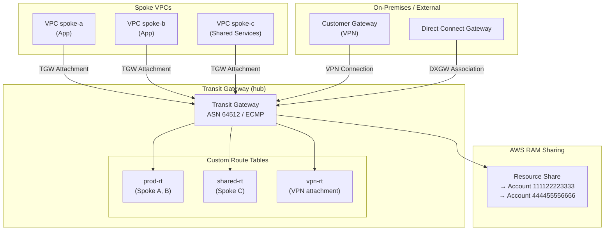

# tf-aws-transit-gateway

Terraform module for AWS Transit Gateway — hub-and-spoke networking for on-premises and multi-VPC connectivity.

## Architecture



## Features

- Transit Gateway with configurable ASN, ECMP, multicast
- VPC attachments (`for_each`)
- Custom route tables with static routes and propagations
- VPN and Direct Connect Gateway associations
- AWS RAM sharing to other accounts/OUs
- `prevent_destroy` on TGW

## Versioning

Review [CHANGELOG.md](CHANGELOG.md) before selecting a module version. Use explicit git tags such as `?ref=v1.0.0`, `?ref=v1.1.0`, or `?ref=v2.0.0` so deployments stay predictable.
## Usage

```hcl
module "tgw" {
  source = "git::https://github.com/your-org/tf-modules.git//tf-aws-transit-gateway?ref=v1.0.0"

  name        = "hub"
  environment = "prod"

  vpc_attachments = {
    spoke_a = {
      vpc_id     = module.vpc_a.vpc_id
      subnet_ids = module.vpc_a.private_subnet_ids_list
    }
    spoke_b = {
      vpc_id     = module.vpc_b.vpc_id
      subnet_ids = module.vpc_b.private_subnet_ids_list
    }
  }

  # Share with member accounts
  ram_share_enabled = true
  ram_principals    = ["111122223333", "444455556666"]
}
```

## On-Premises Connectivity

```hcl
# 1. Create VPN (see tf-aws-vpn module)
# 2. Attach VPN to TGW
module "vpn" {
  source = "../tf-aws-vpn"
  transit_gateway_id = module.tgw.tgw_id
  ...
}
```

## Examples

- [Basic](examples/basic/)
- [Complete hub-and-spoke](examples/complete/)

