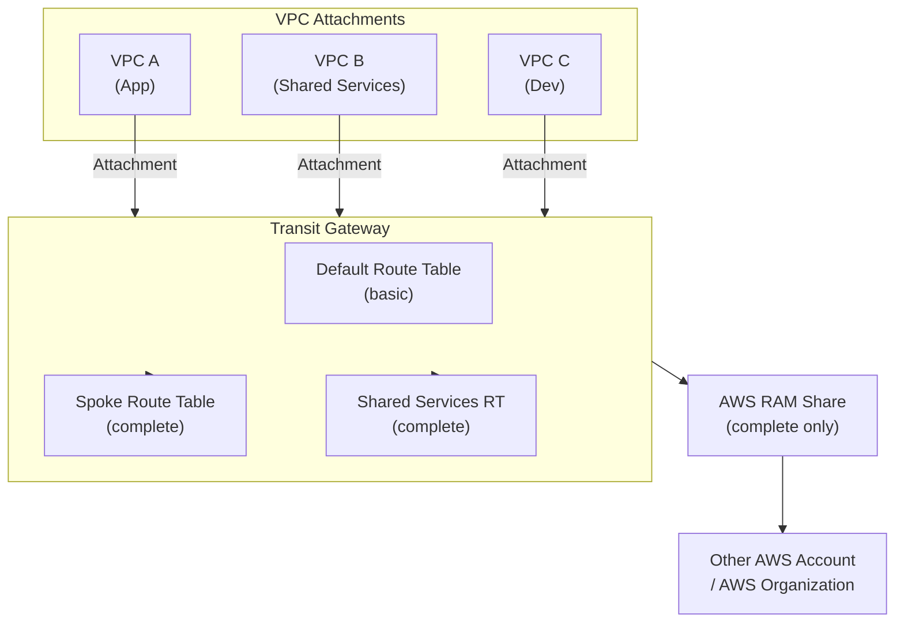

# tf-aws-transit-gateway Examples

Runnable examples for the [`tf-aws-transit-gateway`](../) Terraform module.

## Available Examples

| Example | Description |
|---------|-------------|
| [basic](basic/) | Minimal configuration — Transit Gateway with VPC attachments using default route table association and propagation |
| [complete](complete/) | Full configuration with custom route tables, static routes, VPC attachments, ECMP support, and AWS RAM sharing to other accounts or AWS Organizations |

## Architecture



## Quick Start

```bash
cd basic/
terraform init
terraform apply -var-file="dev.tfvars"
```
