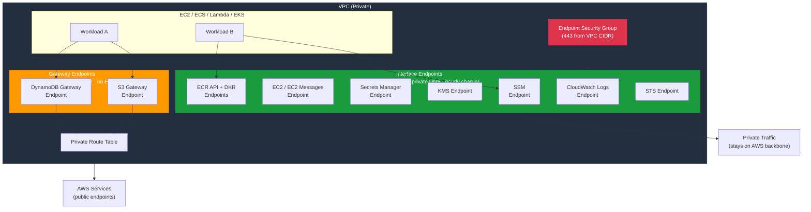

# tf-aws-vpc-endpoints

Terraform module for AWS VPC Endpoints — Gateway endpoints (S3, DynamoDB) and Interface endpoints (SSM, EC2, Secrets Manager, KMS, ECR, and more) to keep traffic on the AWS private network.

---

## Architecture



---

## Features

- **Gateway Endpoints** — S3 and DynamoDB: route-table based, no ENI, no hourly charge
- **Interface Endpoints** — Any AWS service via PrivateLink ENI with optional private DNS
- Configurable per-endpoint subnet IDs, security groups, and endpoint policies
- Default subnet/security group/route-table fallback for all endpoints
- Supports both full service name ARNs and shorthand aliases (e.g., `"s3"`)
- Private DNS enabled by default for interface endpoints

## Why VPC Endpoints?

| Without Endpoints | With Endpoints |
|------------------|----------------|
| Traffic exits VPC via NAT/IGW | Traffic stays on AWS backbone |
| NAT Gateway data-processing charges | Gateway endpoints free; Interface endpoints reduce NAT costs |
| Harder to enforce data-perimeter | Endpoint policies restrict which resources are accessible |
| Higher latency for EC2→S3 | Lower latency, no public routing |

## Security Controls

| Control | Implementation |
|---------|---------------|
| Network isolation | Interface endpoints have no public IP |
| Endpoint policies | JSON policy scoped to specific buckets/resources |
| Security groups | Interface endpoints restricted to VPC CIDR on 443 |
| Private DNS | Resolves `*.s3.amazonaws.com` to private IPs |

## Versioning

Use explicit git tags such as `?ref=v1.0.0` to pin your deployments.

## Usage

```hcl
module "vpc_endpoints" {
  source = "git::https://github.com/your-org/golden_modules.git//tf-aws-vpc-endpoints?ref=v1.0.0"

  vpc_id = module.vpc.vpc_id

  default_subnet_ids         = module.vpc.private_subnet_ids
  default_security_group_ids = [aws_security_group.endpoints.id]
  default_route_table_ids    = module.vpc.private_route_table_ids

  endpoints = {
    s3 = {
      service_name      = "com.amazonaws.us-east-1.s3"
      vpc_endpoint_type = "Gateway"
    }
    dynamodb = {
      service_name      = "com.amazonaws.us-east-1.dynamodb"
      vpc_endpoint_type = "Gateway"
    }
    ssm = {
      service_name      = "com.amazonaws.us-east-1.ssm"
      vpc_endpoint_type = "Interface"
      private_dns       = true
    }
    secretsmanager = {
      service_name      = "com.amazonaws.us-east-1.secretsmanager"
      vpc_endpoint_type = "Interface"
      private_dns       = true
    }
    ecr_api = {
      service_name      = "com.amazonaws.us-east-1.ecr.api"
      vpc_endpoint_type = "Interface"
      private_dns       = true
    }
    ecr_dkr = {
      service_name      = "com.amazonaws.us-east-1.ecr.dkr"
      vpc_endpoint_type = "Interface"
      private_dns       = true
    }
  }
}
```

## Common Interface Endpoints

| Service | Shorthand | Required For |
|---------|-----------|-------------|
| SSM | `ssm`, `ssmmessages`, `ec2messages` | SSM Session Manager (no bastion) |
| ECR | `ecr.api`, `ecr.dkr` | ECS/EKS pulling from ECR |
| Secrets Manager | `secretsmanager` | App secrets in private subnets |
| KMS | `kms` | CMK operations without NAT |
| CloudWatch Logs | `logs` | Lambda/ECS log delivery |
| STS | `sts` | AssumeRole without NAT |

## Examples

- [Core endpoints for EKS cluster](examples/eks-core/)
- [All common endpoints](examples/complete/)
