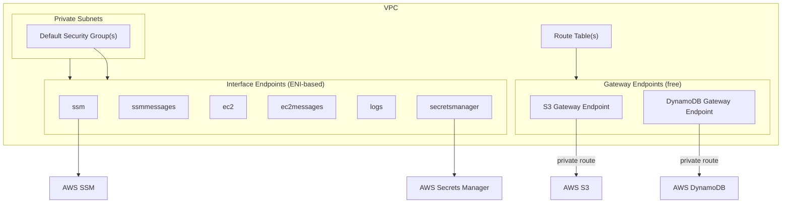

# tf-aws-vpc-endpoints Examples

Runnable examples for the [`tf-aws-vpc-endpoints`](../) Terraform module.

## Available Examples

| Example | Description |
|---------|-------------|
| [basic](basic/) | Minimal configuration — create gateway and interface VPC endpoints using variable-driven endpoint definitions with shared subnet and security group defaults |

## Architecture



## Quick Start

```bash
cd basic/
terraform init
terraform apply -var-file="dev.tfvars"
```
