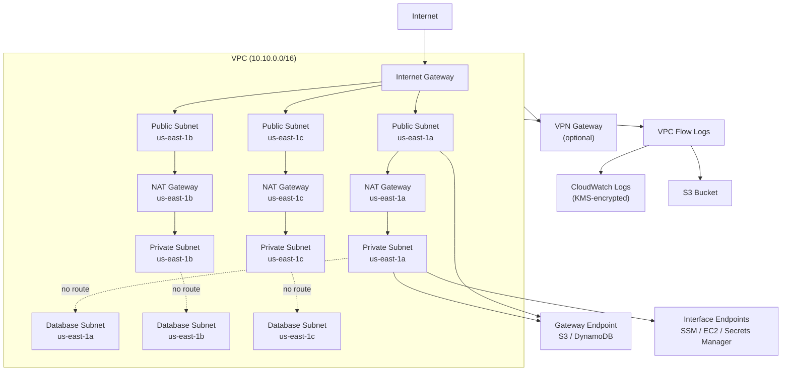

# tf-aws-vpc

Terraform module for AWS VPC with production-ready defaults.

## Features

- VPC with configurable CIDR, DNS, and tenancy settings
- Public / Private / Database (isolated) subnets across multiple AZs
- Single or HA NAT Gateways (one per AZ)
- Internet Gateway
- VPN Gateway
- VPC Flow Logs → CloudWatch Logs (KMS-encrypted) or S3
- Gateway VPC Endpoints: S3, DynamoDB
- Interface VPC Endpoints (SSM, EC2, Secrets Manager, etc.)
- RDS DB Subnet Group created automatically when ≥ 2 database subnets
- Custom DHCP Options
- `prevent_destroy` lifecycle guard on VPC and subnets
- `for_each` keyed by AZ for stable subnet addressing

## Security Controls

| Control | Implementation |
|---------|---------------|
| Flow log encryption | `flow_log_kms_key_id` |
| No public IPs by default | `map_public_ip_on_launch = false` |
| Isolated database tier | Separate subnets, no IGW/NAT routes |
| VPC endpoints (avoid public internet) | `enable_s3_endpoint`, `interface_endpoints` |
| Deletion protection | `lifecycle { prevent_destroy = true }` |

## Architecture



## Versioning

Review [CHANGELOG.md](CHANGELOG.md) before selecting a module version. Use explicit git tags such as `?ref=v1.0.0`, `?ref=v1.1.0`, or `?ref=v2.0.0` so deployments stay predictable.
## Usage

```hcl
module "vpc" {
  source = "git::https://github.com/your-org/tf-modules.git//tf-aws-vpc?ref=v1.0.0"

  name               = "platform"
  environment        = "prod"
  availability_zones = ["us-east-1a", "us-east-1b", "us-east-1c"]
  cidr_block         = "10.10.0.0/16"

  public_subnet_cidrs   = ["10.10.0.0/24", "10.10.1.0/24", "10.10.2.0/24"]
  private_subnet_cidrs  = ["10.10.10.0/24", "10.10.11.0/24", "10.10.12.0/24"]
  database_subnet_cidrs = ["10.10.20.0/24", "10.10.21.0/24", "10.10.22.0/24"]

  enable_nat_gateway = true
  single_nat_gateway = false
  enable_flow_log    = true
}
```

## NAT Gateway Modes

| Mode | Config | Cost | HA |
|------|--------|------|----|
| None | `enable_nat_gateway = false` | $0 | — |
| Single | `single_nat_gateway = true` | Low | No |
| HA | `single_nat_gateway = false` | Medium | Yes |

## Version Safety

- VPC and subnets have `prevent_destroy = true`.
- Subnets are keyed by AZ (`for_each`), not index (`count`), so adding/removing an AZ never causes re-indexing and destruction of other subnets.
- Use `moved {}` blocks when refactoring module source paths.

## Examples

- [Basic](examples/basic/)
- [Complete](examples/complete/)

