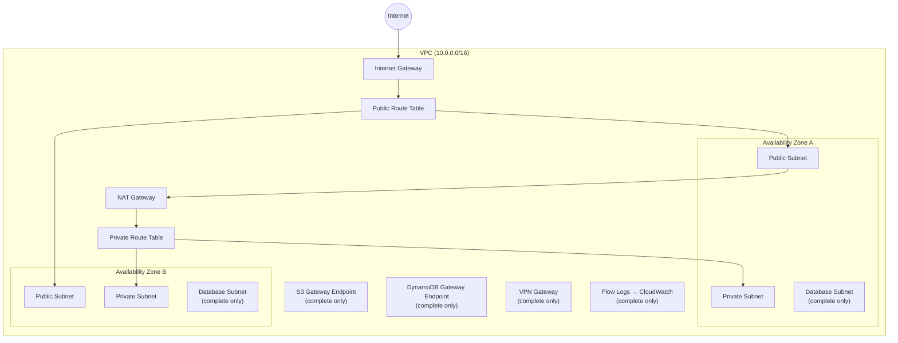

# tf-aws-vpc Examples

Runnable examples for the [`tf-aws-vpc`](../) Terraform module.

## Available Examples

| Example | Description |
|---------|-------------|
| [basic](basic/) | Minimal configuration — public and private subnets across AZs with a single NAT gateway |
| [complete](complete/) | Full configuration with public, private, and database subnet tiers, VPN gateway, S3/DynamoDB gateway endpoints, interface endpoints, VPC Flow Logs to CloudWatch with KMS encryption, and DNS settings |

## Architecture



## Quick Start

```bash
cd basic/
terraform init
terraform apply -var-file="dev.tfvars"
```
