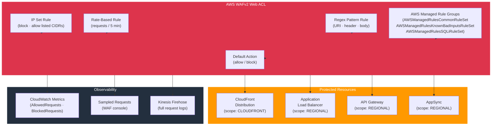

# tf-aws-waf

Terraform module for AWS WAFv2 — Web ACLs with AWS managed rule groups, custom rules, IP sets, regex pattern sets, rate limiting, CAPTCHA/Challenge actions, CloudWatch metrics, and scoped deployments (CloudFront or regional ALB/API Gateway).

---

## Architecture



---

## Features

- Web ACLs for **CLOUDFRONT** (global) or **REGIONAL** (ALB, API GW, AppSync, Cognito)
- AWS Managed Rule Groups: Common, Known-Bad-Inputs, SQLi, Linux, Windows, PHP, WordPress
- Custom IP sets (IPv4/IPv6) for allow-lists and block-lists
- Regex pattern sets for matching URI paths, headers, query strings, or body content
- Rate-based rules to throttle IPs exceeding a request threshold
- CAPTCHA and Challenge action support
- Override rule actions from block → count for testing without disruption
- CloudWatch metrics, sampled request logging, and Kinesis full request logging
- Token domain configuration for cross-domain CAPTCHA tokens

## Security Controls

| Control | Implementation |
|---------|---------------|
| SQL injection | `AWSManagedRulesSQLiRuleSet` |
| XSS / known exploits | `AWSManagedRulesCommonRuleSet` |
| IP reputation | `AWSManagedRulesAmazonIpReputationList` |
| Bot control | `AWSManagedRulesBotControlRuleSet` |
| Custom block list | `ip_sets` with `block` action |
| Rate limiting | Rate-based rule per IP |

## Versioning

Use explicit git tags such as `?ref=v1.0.0` to pin your deployments.

## Usage

```hcl
module "waf" {
  source = "git::https://github.com/your-org/golden_modules.git//tf-aws-waf?ref=v1.0.0"

  name           = "api-protection"
  scope          = "REGIONAL"
  default_action = "allow"

  ip_sets = {
    internal_allow = {
      addresses           = ["10.0.0.0/8", "172.16.0.0/12"]
      ip_address_version  = "IPV4"
    }
    threat_block = {
      addresses           = ["203.0.113.0/24"]
      ip_address_version  = "IPV4"
    }
  }

  managed_rule_groups = [
    {
      name            = "AWSManagedRulesCommonRuleSet"
      priority        = 10
      override_action = "none"
    },
    {
      name            = "AWSManagedRulesSQLiRuleSet"
      priority        = 20
      override_action = "none"
    },
  ]

  cloudwatch_metrics_enabled = true
  sampled_requests_enabled   = true
}

# Associate with ALB
resource "aws_wafv2_web_acl_association" "alb" {
  resource_arn = module.alb.lb_arn
  web_acl_arn  = module.waf.web_acl_arn
}
```

## AWS Managed Rule Groups Reference

| Rule Group | Protects Against |
|-----------|-----------------|
| `AWSManagedRulesCommonRuleSet` | OWASP Top 10, generic web exploits |
| `AWSManagedRulesSQLiRuleSet` | SQL injection attacks |
| `AWSManagedRulesKnownBadInputsRuleSet` | Log4j, Spring4Shell, path traversal |
| `AWSManagedRulesLinuxRuleSet` | Linux OS specific exploits |
| `AWSManagedRulesAmazonIpReputationList` | Known malicious IP addresses |
| `AWSManagedRulesBotControlRuleSet` | Scrapers, crawlers, bad bots |

## Examples

- [Regional ALB protection](examples/regional-alb/)
- [CloudFront global protection](examples/cloudfront/)
- [Full stack with logging](examples/complete/)
