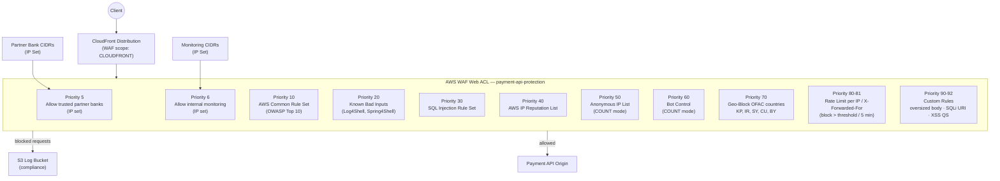

# tf-aws-waf Examples

Runnable examples for the [`tf-aws-waf`](../) Terraform module.

## Available Examples

| Example | Description |
|---------|-------------|
| [payment-api-protection](payment-api-protection/) | Full protection stack for a fintech payment API attached to CloudFront — OWASP managed rules, bot control, OFAC country geo-blocking, per-IP rate limiting, trusted partner bank allow-listing, body size constraints, and compliance logging to S3 |

## Architecture



## Quick Start

```bash
cd payment-api-protection/
terraform init
terraform apply -var-file="dev.tfvars"
```
